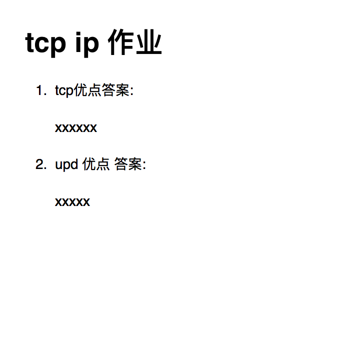

# 睿峰 python linux socket等教学笔记和作业

## linux

<a href="linux/basic_linux/linux_cmd_basic.md">linux命令行</a>

<a href="linux/basic_linux/vim.md">vim编辑器</a>

<a href="linux/basic_linux/python_paramiko.md">paramiko</a>

<a href="linux/basic_linux/fuck_gfw.md">翻墙教程</a>

<a href="tcp_ip_socket/notes/http_proto.md">http协议</a>

<a href="class_work/tcp_ip/1_data_transfer.md">http协议课堂作业</a>

<a href="tcp_ip_socket/notes/tcp_proto.md">tcp协议</a>

<a href="class_work/tcp_ip/2_tcp_udp.md">tcp协议课堂作业</a>

<a href="tcp_ip_socket/notes/ip_proto.md">ip协议</a>

<a href="tcp_ip_socket/notes/socket.md">socket教程</a>

<a href="tcp_ip_socket/notes/multi_thread.md">多线程</a>

<a href="tcp_ip_socket/notes/multi_syn.md">多线程同步</a>

<a href="tcp_ip_socket/notes/basic_crwaler.md">简单爬虫</a>

<a href="tcp_ip_socket/notes/multi_queue.md">线程池,线程通信</a>

<!--<a href="tcp_ip_socket/notes/multi_syn_condition.md">多线程同步（高级）</a>-->

<a href="tcp_ip_socket/notes/io_select.md">io多路复用select函数</a>

<a href="tcp_ip_socket/notes/generator_basic.md">生成器到协程yield</a>

<a href="tcp_ip_socket/notes/generator_basic_yield_from.md">生成器到协程yield_from</a>

<a href="tcp_ip_socket/notes/async1.md">协程</a>

<a href="tcp_ip_socket/notes/async_chat.md">asyncore聊天室制作</a>

<a href="tcp_ip_socket/notes/study_requires.md">本模块学习要求</a>

<!--<a href="tcp_ip_socket/notes/aiohttp.md">aiohttp爬虫制作</a>

<a href="linux/basic_linux/python_syn_attc.md">syn攻击</a>-->

## mysql

1. <a href="mysqls/mysql_basic1.md">权限 基础操作 数据类型 部分函数</a>

2. <a href="mysqls/mysql_basic2.md">查询语句</a>

	2.1 <a href="mysqls/word_pratices/mysql_basic_pratice1.docx">基础查询语句习题-mysql基础练习题-1</a>

3. <a href="mysqls/mysql_basic5.md">查询案例</a>

4. <a href="mysqls/mysql_basic4.md">存储程序</a>

5. <a href="mysqls/mysql_basic3.md">mysql索引</a>

6. <a href="mysqls/mysql_basic7.md">mysql引擎</a>

7. <a href="mysqls/mysql_basic9.md">mysql锁</a>

8. <a href="mysqls/mysql_basic8.md">mysql隔离级别和事务</a>

9. <a href="mysqls/mysql_basic12.md">mvcc</a>

10. <a href="mysqls/mysql_basic10.md">mysql 主从配置 集群</a>

11. <a href="mysqls/mysql_basic13.md">其他杂碎知识点</a>

12. <a href="mysqls/mysql_basic6.md">学习要求和参考</a>

## 作业说明:
	
   1. 请将作业放在远程md文档上面,注明作业属于哪个作业
   2. 请用邮件获取其他方式告知你的远程仓库地址
   3. 邮箱 1210999688@qq.com
   
   
    
## linux & socket阶段作业

|班级|作业号|作业提交时间|   
|---|---|---|
|p1804 | 6,7 |2018.10.14之前 |
|p1805 |1.1, 1.2 ,1.3(1.3选做) |2018.11.21 |
|p1805 |  2,3,4,5,6,7,8 | 2018.12.3|
|p1806 |  2,3,4 | 2019 |
|p1901 | 1.1,1.2 ,2 | 2019.4.4 |
|p1901 | 3部分的 1 2题 | 2019.4.1 晚上 |
|p1901 | 3部分的 3题 4题| 2019.4.2 晚上 |
|p1901 | mysql作业 | 2019.4.21 之前 |

<a href="homeworks/linux/linux_cmd_prictice_basic.md">1.1 linux习题 </a>

<a href="homeworks/linux/git_prictice.md">1.2 git习题</a>

<a href="homeworks/linux/linux_cmd_prictice.md">1.3 linux&git综合作业</a>

<a href="homeworks/tcp_ip_socket/tcp_ip_proto_homework.md">2. tcp/ip综合作业</a>

<a href="homeworks/tcp_ip_socket/socket_coding.md">3. socket编程练习</a>

<a href="homeworks/muti_thread/muti_basic_coding_homework.md">4.多线程基础练习</a>

<a href="homeworks/tcp_ip_socket/io_async.md">6.io多路复用,async作业</a>

<a href="homeworks/tcp_ip_socket/yield_from.md">7.yield |yield from作业</a>

<a href="homeworks/tcp_ip_socket/async.md">8.async作业</a>

<a href="homeworks/tcp_ip_socket/summarize.md">9.综合总结</a>

## mysql 阶段作业

1. <a href="mysqls/word_pratices/mysql_basic_pratice2.doc">mysql查询语句练习1-基础练习集2</a>

2. <a href="mysqls/word_pratices/mysql_basic3.doc">mysql查询语句练习2-基础练习集3</a>

3. <a href="mysqls/word_pratices/mysql_basic4.doc">mysql查询语句练习3-基础练习集4</a>

4. <a href="mysqls/word_pratices/mysql_basic5.doc">mysql查询语句练习4-基础练习集5</a>

#1901 mysql考试

4. <a href="p1901/sql_exam/sql_exam.md">p1901_mysql考试</a>