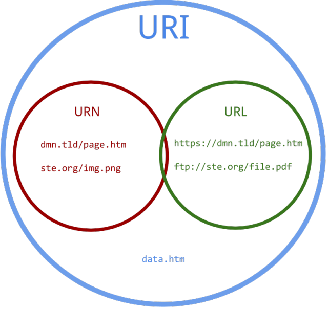
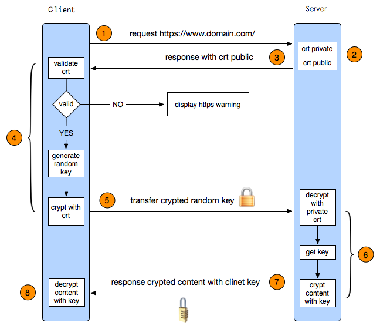

http:

1. Http与Https的区别
 1. HTTP 的URL 以http:// 开头，而HTTPS 的URL 以https:// 开头
 2. HTTP 是不安全的，而 HTTPS 是安全的
 3. HTTP 标准端口是80 ，而 HTTPS 的标准端口是443
 4. 在OSI 网络模型中，HTTP工作于应用层，而HTTPS 的安全传输机制工作在传输层
 5. HTTP 无法加密，而HTTPS 对传输的数据进行加密
 6. HTTP无需证书，而HTTPS 需要CA机构wosign的颁发的SSL证书

2. URI和URL的区别

    1. URI，是uniform resource identifier，统一资源标识符，用来唯一的标识一个资源。

        1. Web上可用的每种资源如HTML文档、图像、视频片段、程序等都是一个来URI来定位的
    URI一般由三部组成：
    ①访问资源的命名机制
    ②存放资源的主机名
    ③资源自身的名称，由路径表示，着重强调于资源

    2. URL是uniform resource locator，统一资源定位器，它是一种具体的URI，即URL可以用来标识一个资源，而且还指明了如何locate这个资源。

	    1. URL是Internet上用来描述信息资源的字符串，主要用在各种WWW客户程序和服务器程序上，特别是著名的Mosaic。
	    2. 采用URL可以用一种统一的格式来描述各种信息资源，包括文件、服务器的地址和目录等。
	    3. URL一般由三部组成：①协议(或称为服务方式)②存有该资源的主机IP地址(有时也包括端口号)③主机资源的具体地址。如目录和文件名等

	3. URN，uniform resource name，统一资源命名，是通过名字来标识资源，比如mailto:java-net@java.sun.com。

    
    4. URI是以一种抽象的，高层次概念定义统一资源标识，而URL和URN则是具体的资源标识的方式。URL和URN都是一种URI。笼统地说，每个 URL 都是 URI，但不一定每个 URI 都是 URL。这是因为 URI 还包括一个子类，即统一资源名称 (URN)，它命名资源但不指定如何定位资源。上面的 mailto、news 和 isbn URI 都是 URN 的示例。

    
    
    

3. HTTPS工作原理

	1. 首先HTTP请求服务端生成证书，客户端对证书的有效期、合法性、域名是否与请求的域名一致、证书的公钥（RSA加密）等进行校验；
	2. 客户端如果校验通过后，就根据证书的公钥的有效， 生成随机数，随机数使用公钥进行加密（RSA加密）；
	3. 消息体产生的后，对它的摘要进行MD5（或者SHA1）算法加密，此时就得到了RSA签名；
	4. 发送给服务端，此时只有服务端（RSA私钥）能解密。
	5. 解密得到的随机数，再用AES加密，作为密钥（此时的密钥只有客户端和服务端知道）。

	
	
4. 一次完整的HTTP请求所经历的7个步骤

	1. 建立TCP连接
	
	在HTTP工作开始之前，Web浏览器首先要通过网络与Web服务器建立连接，该连接是通过TCP来完成的，该协议与IP协议共同构建Internet，即著名的TCP/IP协议族，因此Internet又被称作是TCP/IP网络。HTTP是比TCP更高层次的应用层协议，根据规则，只有低层协议建立之后才能，才能进行更层协议的连接，因此，首先要建立TCP连接，一般TCP连接的端口号是80。
	
	2. Web浏览器向Web服务器发送请求命令 
	
	一旦建立了TCP连接，Web浏览器就会向Web服务器发送请求命令。例如：GET/sample/hello.jsp HTTP/1.1。
	
	3. Web浏览器发送请求头信息 
	
	浏览器发送其请求命令之后，还要以头信息的形式向Web服务器发送一些别的信息，之后浏览器发送了一空白行来通知服务器，它已经结束了该头信息的发送。 
	
	4. Web服务器应答 
	
	客户机向服务器发出请求后，服务器会客户机回送应答， HTTP/1.1 200 OK ，应答的第一部分是协议的版本号和应答状态码。
	
	5. Web服务器发送应答头信息 
	
	正如客户端会随同请求发送关于自身的信息一样，服务器也会随同应答向用户发送关于它自己的数据及被请求的文档。 
	
	6. Web服务器向浏览器发送数据 
	
	Web服务器向浏览器发送头信息后，它会发送一个空白行来表示头信息的发送到此为结束，接着，它就以Content-Type应答头信息所描述的格式发送用户所请求的实际数据。
	
	7. Web服务器关闭TCP连接 
	
	一般情况下，一旦Web服务器向浏览器发送了请求数据，它就要关闭TCP连接，然后如果浏览器或者服务器在其头信息加入了这行代码：
	
	Connection:keep-alive 
	
	TCP连接在发送后将仍然保持打开状态，于是，浏览器可以继续通过相同的连接发送请求。保持连接节省了为每个请求建立新连接所需的时间，还节约了网络带宽。
	
	
	
5. 常见的HTTP相应状态码

	200：请求被正常处理
	204：请求被受理但没有资源可以返回
	206：客户端只是请求资源的一部分，服务器只对请求的部分资源执行GET方法，相应报文中通过Content-Range指定范围的资源。
	301：永久性重定向
	302：临时重定向
	400：请求报文语法有误，服务器无法识别
	401：请求需要认证
	403：请求的对应资源禁止被访问
	404：服务器无法找到对应资源
	500：服务器内部错误
	503：服务器正忙

tcp:

1. TCP协议和UDP协议的区别是什么

	1. TCP协议是有连接的，有连接的意思是开始传输实际数据之前TCP的客户端和服务器端必须通过三次握手建立连接，会话结束之后也要结束连接。而UDP是无连接的
	
	2. TCP协议保证数据按序发送，按序到达，提供超时重传来保证可靠性，但是UDP不保证按序到达，甚至不保证到达，只是努力交付，即便是按序发送的序列，也不保证按序送到。
	
	3. TCP协议所需资源多，TCP首部需20个字节（不算可选项），UDP首部字段只需8个字节。
	
	4. TCP有流量控制和拥塞控制，UDP没有，网络拥堵不会影响发送端的发送速率
	
	5. TCP是一对一的连接，而UDP则可以支持一对一，多对多，一对多的通信。
	
	6. TCP面向的是字节流的服务，UDP面向的是报文的服务。

2.  TCP建立连接的过程采用三次握手，已知第三次握手报文的发送序列号为555，确认序列号为6666，请问第二次握手报文的发送序列号和确认序列号分别为？

	客户端：发送X
	服务端：发送Y， 确认X+1
	客户端：发送X+1（1000），确认Y+1（2000）
	可以反推第二次为6665,确认555
	
	
3. 
	

	
	
	

    
