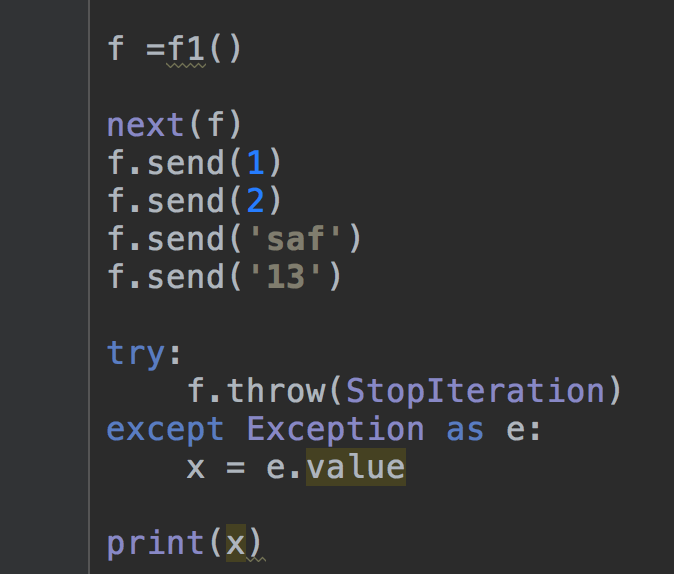
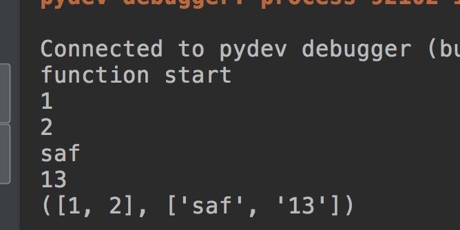

# yield & yield from作业

	
1. 简述yield和协程的关系

2. 怎么去启动一个协程,怎么去关闭一个协程,怎么向协程中去发送值

3. 不看课堂代码,写出一个移动平均值计算器

4. 仿造课堂示例,使用yield动态的接受值,使用一个函数不断的向yield的函数中send值

	要求:
		1. 判断接受过来的参数,如果参数类型是str 则把他加入到一个list里面去,如果参数类型是int则把他加入到另外一个list里面去
		2. 当外面的程序向yield函数抛出异常的时候,yield函数能够返回存储str的list和存储Int的list

	示例:
	
	
	
5. 不看课堂代码,写出一个仿真程序来

作业提交时间

| 班级| 时间|
|---|---|
|p1804|2018.10.14之前|
	