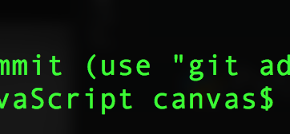
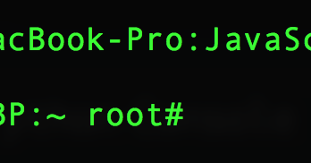

# linux 命令行基础

## shell是什么

#### 1. shell

当我们说的命令行时，我们实际上指的是shell。shell是一个接受由键盘输入的命令,并将其传递给操作系统来执行的程序。几乎所有的Linux发行版都提供shell程序,改程序来自于称之为bash的GNU项目。bash是Bourne Again Shell的首字母缩写。即是sh的增强版本,sh是最初的unix shell程序。

#### 2. 终端仿真器
    
当使用图形用户界面时,需要另一种叫做终端仿真器(terminal)的程序与shell交互。在linux下面有很多不同的终端给你选择使用。

#### 3. 在终端的第一次输入

1. 开打终端,mac,linux都有不同终端。

2. 如何在终端中简单查看是普通用户还是超级用户

    1. 在终端中看到的是 $表示 普通用户执行命令

        
    2. 在终端中看到的是 #表示 超级用户权限正在执行命令
        
        
#### 4. history

1. 在终端中输入history来查看命令历史记录

> 大部分Linux发行版会记录500条命令(最近的)
	
```
$ history
```
2. 我们也可以使用上下键来获取历史记录

3. 我们可以使用! 来获取历史命令

	1. !+num 使用! 加上history里面的命令号码,就可以快捷的打出命令来
	2. !his 他会自动补全上一次的命令,就像正则匹配一样,比如这个命令就会补全我们刚才输入的history命令

#### 5. date cal 查看日期函数
1. 使用date来查看日期
	
	```
	$ date
	```
	
2. 使用cal来获取日历

	```
	$ cal
	```
	
#### 6. exit 结束会话

1. exit在本地输入会退出终端程序
2. exit在ssh登录中会退出远程ssh,但是不会退出程序

#### 7. 目录导航 pwd cd ls

1. 文件目录树

	和其他系统一样,linux系统的也是通过文件夹将目录进行一个层次的划分,文件夹有一个最顶层的目录,叫做根目录。他包含了文件和文件夹,然后这些文件夹再包含子文件和文件夹依次类推。这种结构我们称为文件系统树
	
	> 在linux中,不管你有多少个存储设备,通常只有一个文件系统树。
	
	文件的根目录用 / 表示
	
	在linux中我们可以使用 
	
	```
	$ tree /
	```
	来查看 / 目录的下面的结构

2. pwd 查看当前工作(所在)目录

	```
	$ pwd
	```

3. ls  列出当前工作目录和文件和目录
	
	```
	$ ls
	```
	
4. 更改当前工作目录

	1. cd 命令：就像我们windows一样,我们也可以在linux里面去切换所在的文件夹,cd 后面跟上目录的名称就可以直接切换到某个目录
	
	    ```
	    $ cd /Users/canvas/Desktop/project/web_font_notes
	    ```
	2. 绝对路径: 上述所使用的方式是使用了绝对路径,绝对路径是指从根目录开始 以 ```/``` 号为目录的层级分割,一层层的到达所指的目录。
	比如上面所说的:
	```
	/Users/canvas/Desktop/project/web_font_notes
	```
	
	3. 相对路径: 既然有绝对路径,那么就有相对路径,就是相对本工作目录的其他目录所在的位置,比如找到本目录所属的上级```../```目录或者目录下面的某个目录```./```

5. 快捷命令

	```
	回到刚才所在的目录
	cd -
	到用户的根目录下面
	cd ~
	到xx用户的根目录下面
	cd ~username
	```
	
6. linux用户目录

    我们知道 linux的根目录是 ```/```,linux是一个多用户的系统,每一个用户都有自己的独立的空间, ```~```代表进入到本用户独立的空间中(根目录),一般 Linux的用户空间是存在于 ```/home/```下面的
    
7. 更多的ls扩展命令

	1. ls 可以直接显示本文件下面的文件

		```
		canvasdeMBP:web_font_notes canvas$ ls
		06_js_anwser.html		class_question_and_anwser	home_work_and_anwser
		```
	
	2. ls 后面跟上文件路径可以查看那个文件夹中的子文件

		```
		canvasdeMBP:web_font_notes canvas$ ls ./css/
		
		css_basic	css_cases	css_layout	test
		
		```
	3. 可以使用长格式来获取更多的细节(相当于扩展的命令)

		```
		canvasdeMBP:web_font_notes canvas$ ls -l
		
		-rw-r--r--   1 canvas  staff  2308  8 27 16:29 06_js_anwser.html
	-rw-r--r--@  1 canvas  staff  4305  9 13 21:17 README.md
	drwxr-xr-x   2 canvas  staff    64  9  3 18:37 bootstrap
		
		```
		
	
#### 8. 命令的选项和参数

大部分命令是可以通过参数来使命令有不同的效果的,大致的命令格式如下:

```
command -options arguments
```

就像上面的命令一样 加上命令的选项

```
canvasdeMBP:web_font_notes canvas$ ls -lt
total 40
-rw-r--r--@  1 canvas  staff  4305  9 13 21:17 README.md
drwxr-xr-x  10 canvas  staff   320  9 13 21:14 jquery
drwxr-xr-x   8 canvas  staff   256  9 13 16:56 js
drwxr-xr-x   6 canvas  staff   192  9 13 08:58 css
drwxr-xr-x   3 canvas  staff    96  9  9 22:10 sources
```

```t```表示以时间顺序来查看子文件,```lt```是``` -l``` 和```-t```的联合使用,表示以长格式输出,并且以时间来排序

也可以使用长格式来输出

```
canvasdeMBP:web_font_notes canvas$ ls -lt -reverse

 8 -rw-r--r--   1 canvas  staff  2308  8 27 16:29 06_js_anwser.html
 0 drwxr-xr-x   2 canvas  staff    64  9  3 18:37 bootstrap
 0 drwxr-xr-x   5 canvas  staff   160  9  5 14:42 pics
 0 drwxr-xr-x   4 canvas  staff   128  9  5 14:46 class_question_and_anwser

```

长格式中 ```-reverse```是长格式的写法,就像 ```-l```也可以写```-long```的方式表达

所以说 命令可以使用长格式或者短格式来输出,有些版本的linux可能需要 ```--long```来表示长格式

#### 9. ls命令显示的解释

当输入 ```ls -l``` 之后,会显示如下

```
canvasdeMBP:web_font_notes canvas$ ls -lt -reverse

 8 -rw-r--r--   1 canvas  staff  2308  8 27 16:29 06_js_anwser.html
 0 drwxr-xr-x   2 canvas  staff    64  9  3 18:37 bootstrap
 0 drwxr-xr-x   5 canvas  staff   160  9  5 14:42 pics
 0 drwxr-xr-x   4 canvas  staff   128  9  5 14:46 class_question_and_anwser

```

|字段|含义|
|---|---|
|-rw-r--r--|第一个字符 -表示文件 如果是d表示文件夹 后面的rw等等表示的是本用户,用户组,其他用户对这个文件或者文件夹的使用权限|
|1|文件硬链接数目|
|canvas|文件所有者|
|staff|文件所属用户组|
|2308|以字节数显示文件大小|
|18:37|文件的上次修改时间|
| pics |文件的名称|


ls命令含义总结:

|参数|描述|
|---|---|
|-a| –all 列出目录下的所有文件，包括以 . 开头的隐含文件|
| -l | 除了文件名之外，还将文件的权限、所有者、文件大小等信息详细列出来  |
| -d | –directory 将目录象文件一样显示，而不是显示其下的文件  |
|-h   | –human-readable 以容易理解的格式列出文件大小 (例如 1K 234M 2G)  |
| -t |  以文件修改时间排序 |


#### 10. file用法

在探索linux系统的时候,知道文件的类型是很有用的,我们在windows上面一般是通过查看文件名的后缀来知晓文件的类型的``` meinv.jpg ```,
但是在linux上面,文件的名字和文件本身的类型并不挂钩,所以不管是什么类型的文件我们都可以随便的起名字。但是我们可以通过file这个命令来查看文件的类型

```
canvasdeMBP:bin canvas$ file lzma
lzma: Mach-O 64-bit executable x86_64

```

通过上面我们可以看到,文件的类型是可执行的64位程序

#### 11. less命令的使用

less命令可以帮我们查看文件里面的内容

我们可以直接去less一个文件

```
less lzcmp

```
当我们less的时候,使用 j向下翻 k向上翻 q退出 这和vim编辑器有点类似

#### 12. linux 默认目录说明

1. ```/``` 系统根目录
2. ```/bin``` 包含系统启动和运行所需要的二进制文件(binary)
3. ``` /dev ``` 设备节点特殊目录。内核将它能够识别的所有设备存放在这个目录(linux一切皆文件 设备也要看成文件)
4. ``` /etc ``` 一般的配置文件都在里面
5. ``` /home ``` 由于Linux是多用户的 所以每个用户都有自己独立空间,普通的用户只有权限在这里创建文件。
6. ``` lib```  linux 核心系统使用的共享库文件
7. ``` /lost+found ``` 当系统崩溃时,该目录用于恢复分区。(严重的问题) 
8. ```/media``` 可移除媒体设备挂载点。比如usb驱动 cd-rom等。当设备插入计算机后,会自动的挂载到这个目录节点下面
9. ```/mnt``` 早期linux系统中 /mnt 目录包含手动挂载可移除的设备挂载点
10. ```/opt``` 安装可选软件,一般用户自己下载的软件放在这里
11. ```/root ```root账户的主目录
12. ```/sbin``` 系统二进制文件。重要的系统文件。为超级用户预留的 
13. ```/tmp``` 提供用户存放各种临时系统文件的目录 可以配置每次重启系统时清空这个目录
14. ```/usr``` 包含普通用户使用的所有程序和相关文件
15. ```/usr/bin``` 目录中放置了一些Linux发行版安装的可以执行程序。存储成千上万个程序
16. ```/usr/lib```  /usr/bin中使用的共享库
17. ```/usr/local``` 由源代码编译好的程序通常安装在/usr/local/bin中
18. ```/usr/sbin``` 更多的管理员程序
19. ```/var``` 存放有可能改变的目录，比如说系统日志  

#### 操作文件和目录 cp mv ..

<!--1. shell通配符

	>当操作文件的时候,可以使用通配符来匹配文件,这样就可以批量的操作文件
	
	| 通配符|意义 |
	|---|---|
	|*  |匹配任意多个字符（包括零个或一个）|
	| ?|匹配任意一个字符（不包括零个） |
	|[characters]  |匹配任意一个属于字符集中的字符|
	|[!characters]  |匹配任意一个不是字符集中的字符  |
	| [[:class:]]  |匹配任意一个属于指定字符类中的字符|
	| [:alnum:]  |匹配任意一个字母或数字）|
	| [:alpha:]  |匹配任意一个字母  |
	|[:digit:]  |匹配任意一个数字  |
	| [:lower:] |  匹配任意一个小写字母  |
	| [:upper]   |匹配任意一个大写字母  |
	
	示例
	
	1. ```[[:upper]]*``` 以大写字母开头的文件
	2. ```*[[:lower:]123] ```  文件名以小写字母结尾，或以 “1”，“2”，或 “3” 结尾的文件  
	3. ```[abc]*``` 文件名以“a”,“b”,或“c”开头的文件  
	4. ```Data??? ```  以“Data”开头，其后紧接着3个字符的文件  -->

2.  mkdir 

	说明: mkdir是用来创建目录的
	
	>可以一次性创建一个文件夹或者多个文件夹
	
	```
	
	$ mkdir dir1   
	
	$ mkdir dir1 dir2 dir3
	```
	
	命令参数:
	
	|  参数 |  描述 |
	| ---|---|
	|  -m --mode=模式	 |  设定权限<模式> |
	|   -p --parents  |    可以是一个路径名称。若路径中的某些目录尚不存在,加上此选项后,系统将自动建立好那些尚不存在的目录,即一次可以建立多个目录 |
	|  -v --verbose   | 每次创建新目录都显示信息    |
	
	>递归创建多个目录
	
	```
	$ mkdir -p testmkdir/testmkdir
	```
	
	>创建权限为 777 的目录
	
	```
	$ mkdir -m 777 -p test/test1
	```

3. cp命令
	
	说明: cp命令是用来复制文件或者目录的
	
	> 复制文件到哪个文件
	
	```
	$ cp file1 fil2
	
	```
	
	> 复制文件到xx文件里面
	
	```
	$cp file1 file2 dir2
	```
	
	> 复制文件夹到另一个文件夹中
	
	```
	cp -r dir1 dir3
	```
	
	> 复制文件夹到文件夹，区别在于 test_dir1不存在会创建新的文件夹
	
	```
	$ cp -r dir1 test_dir1
	```
	
	> 复制文件中的所有文件到另一个文件夹中
	
	```
	cp dir/* dir3
	```
	
	
	> 扩展选项
	
	|选项 |意义 |
	|---|---|
	| -a | 复制文件和目录，以及它们的属性，包括所有权和权限。 默认情况下，复本具有用户所操作文件的默认属性。  |
	|-i |在重写已存在文件之前，提示用户确认。如果这个选项不指定， cp 命令会默认重写文件。 |
	| -r|递归地复制目录及目录中的内容。当复制目录时， 需要这个选项（或者-a 选项）。   |
	|-u | 当把文件从一个目录复制到另一个目录时，仅复制 目标目录中不存在的文件，或者是文件内容新于目标目录中已经存在的文件。  |
	| -v | 显示翔实的命令操作信息   |
	| -n | 不要覆盖已存在的文件(使前面的 -i 选项失效) |

4. mv命令 移动文件或者文件夹

	mv的命令和cp命令有许多的相似
	
	> 扩展选项
	
	|  参数 | 描述  |
	|---|---|
	|-i |在重写已存在文件之前，提示用户确认。如果这个选项不指定， cp 命令会默认重写文件。 |
	|-u | 当把文件从一个目录移动到另一个目录时，仅移动 目标目录中不存在的文件，或者是文件内容新于目标目录中已经存在的文件。  |
	| -v | 显示翔实的命令操作信息   |
	| -f | 如果目标文件已经存在，不会询问而直接覆盖|

	
	> 移动文件到哪个文件
	
	```
	$ mv file1 file2
	
	```
	
	> 移动目录到哪个目录
	
	```
	$cp dir1 dir2
	```
	
	> 移动目录或文件到到哪个目录下
	
	```
	$cp file dir2
	```

5. rm命令

	说明: rm删除文件 这是一个危险的命令 因为linux没有回收站 所以当你删除了文件是不能后悔的

	|选项 |意义 |
	|---|---|
	|-i |在删除之前，提示用户确认。 |
	| -r|递归地删除目录及目录中的内容|
	| -f | 忽视不存在的文件，不显示提示信息  |
	| -v | 显示翔实的命令操作信息 |

	> 删除文件
	
	```
	rm file1 file2
	```
	
	> 删除文件夹
	
	```
	rm -r dir1
	```
	
	
	
	##### 小心 rm! 不要使用 rm / 这样会把你的系统毁掉
	

#### ln 文件链接 （硬链接|硬链接）

1. 硬链接

	```
	$ ln file link
	```

硬链接和符号链接比起来，硬链接是最初 Unix 创建链接的方式，而符号链接更加现代。 在默认情况下，每个文件有一个硬链接，这个硬链接给文件起名字。当我们创建一个 硬链接以后，就为文件创建了一个额外的目录条目

硬链接有两个重要局限性：

1. 一个硬链接不能关联它所在文件系统之外的文件。这是说一个链接不能关联 与链接本身不在同一个磁盘分区上的文件。
2. 一个硬链接不能关联一个目录

> 一个硬链接和文件本身没有什么区别

2. 符号链接

	```
	$ ln -s file link
	```

创建符号链接是为了克服硬链接的局限性。符号链接生效，是通过创建一个 特殊类型的文件，这个文件包含一个关联文件或目录的文本指针。

3. 链接实战


>链接文件

	```
	ln -s  file2 ln_file2
	```
>链接文件夹

	```
	ln -s dir4 ln_dir4
	cd ln_dir4
	```


#### 显示命令

1. 概览:

	1. type – 说明怎样解释一个命令名
	2. which – 显示会执行哪个可执行程序
	3. man – 显示命令手册页
	4. apropos – 显示一系列适合的命令
	5. info – 显示命令 info
	6. whatis – 显示一个命令的简洁描述
	7. alias – 创建命令别名

2. 到底什么是命令

	1. 是一个可执行程序，就像我们所看到的位于目录/usr/bin 中的文件一样。 属于这一类的程序，可以编译成二进制文件，诸如用 C 和 C++语言写成的程序, 也可以是由脚本语言写成的程序，比如说 shell，perl，python，ruby，等等
	2. 是一个内建于 shell 自身的命令。bash 支持若干命令，内部叫做 shell 内部命令 (builtins)。例如，cd 命令，就是一个 shell 内部命令。
	3. 是一个 shell 函数。这些是小规模的 shell 脚本，它们混合到环境变量中。
	4. 是一个命令别名。我们可以定义自己的命令，建立在其它命令之上。

3. type－显示命令的类型

	说明: type 命令是 shell 内部命令，它会显示命令的类别，给出一个特定的命令名（做为参数）。
	
	```
	$ type cd
	
	cd is a shell builtin
	
	$ type ls
	ls is hashed (/bin/ls)
	
	
	```
4. 定位

	1. which － 显示一个可执行程序的位置

		在 PATH 变量指定的路径中搜索可执行文件的所在位置。它一般用来确认系统中是否安装了指定的软件。
	
		说明:有时候在一个操作系统中，不只安装了可执行程序的一个版本。然而在桌面系统中，这并不普遍， 但在大型服务器中，却很平常。为了确定所给定的执行程序的准确位置，使用 which 命令
		
		```
		rimideiMac-10:ln_dir4 admin$ which ls
		/bin/ls
		
		```
	
		> (某些系统中)这个命令只对可执行程序有效，不包括内部命令和命令别名，别名是真正的可执行程序的替代物
	
	2. whereis 命令
	
		whereis 命令主要用于定位可执行文件、源代码文件、帮助文件在文件系统中的位置。whereis 命令还具有搜索源代码、指定备用搜索路径和搜索不寻常项的能力。
	
		whereis 命令查找速度非常快，这是因为它根本不是在磁盘中漫无目的乱找，而是在一个数据库中（/var/lib/mlocate/）查询。这个数据库是 Linux 系统自动创建的，包含有本地所有文件的信息，并且每天通过自动执行 updatedb 命令更新一次。也正是因为这个数据库要每天才更新一次，就会使得 whereis 命令的搜索结果有时候会不准确，比如刚添加的文件可能搜不到。
		
	3. locate 

		locate 命令跟 whereis 命令类似，且它们使用的是相同的数据库。但 whereis 命令只能搜索可执行文件、联机帮助文件和源代码文件，如果要获得更全面的搜索结果，可以使用 locate 命令。
		
		
		
5. help 帮助文档

	```
	rimideiMac-10:ln_dir4 admin$ help cd
	cd: cd [-L|-P] [dir]
	    Change the current directory to DIR.  The variable $HOME is the
	    default DIR.  The variable CDPATH defines the search path for
	    the directory containing DIR.  Alternative directory names in CDPATH
	    are separated by a colon (:).  A null directory name is the same as
	    the current directory, i.e. `.'.  If DIR begins with a slash (/),
	    then CDPATH is not used.  If the directory is not found, and the
	    shell option `cdable_vars' is set, then try the word as a variable
	    name.  If that variable has a value, then cd to the value of that
	    variable.  The -P option says to use the physical directory structure
	    instead of following symbolic links; the -L option forces symbolic links
	    to be followed.
	
	```
	
	>注意表示法：出现在命令语法说明中的方括号，表示可选的项目。一个竖杠字符 表示互斥选项。
	>这种表示法说明，cd 命令可能有一个”-L”选项或者”-P”选项，进一步，可能有参数“dir”

	1. 许多可执行程序支持一个”—help”|-h选项，这个选项是显示命令所支持的语法和选项说明
	
		```
			rimideiMac-10:ln_dir4 admin$ python --help
			usage: python [option] ... [-c cmd | -m mod | file | -] [arg] ...
			Options and arguments (and corresponding environment variables):
			-b     : issue warnings about str(bytes_instance), str(bytearray_instance)
			         and comparing bytes/bytearray with str. (-bb: issue errors)
			-B     : don't write .pyc files on import; also PYTHONDONTWRITEBYTECODE=x
			-c cmd : program passed in as string (terminates option list)
			-d     : debug output from parser; also PYTHONDEBUG=x
			-E     : ignore PYTHON* environment variables (such as PYTHONPATH)
			-h     : print this help message and exit (also --help)
			-i     : inspect interactively after running script; forces a prompt even
			         if stdin does not appear to be a terminal; also PYTHONINSPECT=x
			-I     : isolate Python from the user's environment (implies -E and -s)
			-m mod : run library module as a script (terminates option list)
			-O     : remove assert and __debug__-dependent statements; add .opt-1 before
			         .pyc extension; also PYTHONOPTIMIZE=x
			-OO    : do -O changes and also discard docstrings; add .opt-2 before
			         .pyc extension
			-q     : don't print version and copyright messages on interactive startup
			-s     : don't add user site directory to sys.path; also PYTHONNOUSERSITE
			-S     : don't imply 'import site' on initialization
	
		```
	
	2. 一些程序不支持”—help”选项
		
		```
		rimideiMac-10:ln_dir4 admin$ ls --help
	ls: illegal option -- -
	usage: ls [-ABCFGHLOPRSTUWabcdefghiklmnopqrstuwx1] [file ...]
		```
		
6. man －显示程序手册页

	
	```
	rimideiMac-10:ln_dir4 admin$ man ls
	```
		
	>手册文档的格式有点不同，一般地包含一个标题，命令语法的纲要，命令用途的说明， 和命令选项列表，及每个选项的说明。然而，通常手册文档并不包含实例，它打算 作为一本参考手册，而不是教材。
	

7. apropos 

	```
	rimideiMac-10:ln_dir4 admin$ apropos mkdir
	mkdir(1)                 - make directories
	mkdir(2), mkdirat(2)     - make a directory file
	```
	
8. whatis －显示非常简洁的命令说明

    ```
    
    rimideiMac-10:ln_dir4 admin$ whatis mkdir
	mkdir(1)                 - make directories
	mkdir(2), mkdirat(2)     - make a directory file
    
    ```
   
9. info - 显示程序 Info 条目

说明：GNU 项目提供了一个命令程序手册页的替代物，称为 “info”。info 内容可通过 info 阅读器 程序读取。info 页是超级链接形式的，和网页很相似。

	```
	info ls
	
	```
	
	>info 程序读取 info 文件，info 文件是树型结构，分化为各个结点，每一个包含一个题目。 info 文件包含超级链接，它可以让你从一个结点跳到另一个结点。一个超级链接可通过 它开头的星号来辨别出来，把光标放在它上面并按下 enter 键，就可以激活它。
	
10. alias 创建你自己的命令

	说明: alias 可以用于 自己创建一个属于自己的命令,语句结构 alias name=‘string’
	
	```
	rimideiMac-10:ln_dir4 admin$ ll
	-bash: ll: command not found
	rimideiMac-10:ln_dir4 admin$ alias ll='ls -l'
	rimideiMac-10:ln_dir4 admin$ ll
	total 0
	drwxr-xr-x  5 admin  staff  170  9 19 09:51 dir5
	-rw-r--r--  1 admin  staff    0  9 19 09:43 test2
	
	rimideiMac-10:ln_dir4 admin$ type ll
	ll is aliased to `ls -l'
	```
	

  
#### 重定向

1. 说明 : I/O 重定向。“I/O”代表输入/输出， 通过这个工具，你可以重定向命令的输入输出，命令的输入来自文件，而输出也存到文件。 也可以把多个命令连接起来组成一个强大的命令管道

2. 配合io使用的命令

	cat － 连接文件
	
	sort － 排序文本行
	
	uniq － 报道或省略重复行
	
	grep － 打印匹配行
	
	wc － 打印文件中换行符，字，和字节个数
	
	head － 输出文件第一部分
	
	tail - 输出文件最后一部分


3. 标准输入，输出，和错误

    >与 Unix 主题“任何东西都是一个文件”保持一致，程序，比方说 ls，实际上把他们的运行结果 输送到一个叫做标准输出的特殊文件（经常用 stdout 表示），而它们的状态信息则送到另一个 叫做标准错误的文件（stderr）。默认情况下，标准输出和标准错误都连接到屏幕，而不是 保存到磁盘文件。除此之外，许多程序从一个叫做标准输入（stdin）的设备得到输入，默认情况下， 标准输入连接到键盘。
    
    >I/O 重定向允许我们可以更改输出走向和输入来向。一般地，输出送到屏幕，输入来自键盘， 但是通过 I/O 重定向，我们可以改变输入输出方向。
    

4. 重定向标准输出

	使用 > 把本来应该输出到屏幕上面的信息输出到文本上面

	```
	rimideiMac-10:ln_dir4 admin$ ls / > test1.txt
rimideiMac-10:ln_dir4 admin$ let test1.txt
	```
	
	但是 当我们得到一个错误的输出时候,这个时候程序就不会把信息写入文本
	
	```
	rimideiMac-10:ln_dir4 admin$ ls /bin/ac > test2
ls: /bin/ac: No such file or directory
	```
	
	重定向错误输出的话我们需要使用
	
	```
	rimideiMac-10:ln_dir4 admin$ ls /bin/ac 2> test2
	```

	现在的bash给我们提供了一种方法 同时提供重定向错误和标准输出
	
	```
	rimideiMac-10:ln_dir4 admin$ ls /bin/ac &> test2
	```
	

5. cat (concatenate)－ 连接文件

	cat 命令读取一个或多个文件，然后复制它们到标准输出，就像这样:
	
	```
	rimideiMac-10:ln_dir4 admin$ cat test1.txt 
	Applications
	Library
	Network
	System
	Users
	Volumes
	bin
	cores
	data
	dev
	etc
	home
	installer.failurerequests
	net
	private
	sbin
	tmp
	usr
	var
	
	```
	
	| 参数| 描述|
	| ---|--- |
	|-n |对输出的所有行编号,由 1 开始对所有输出的行数编号|
	|  -s  |   有连续两行以上的空白行，就代换为一行的空白行|
	
	> tac 将 cat 反写过来，所以它的功能就跟 cat 相反，cat 是由第一行到最后一行连续显示在屏幕上，而 tac 则是由最后一行到第一行反向在屏幕上显示出来


6. 管道线


	1. 使用方式:
	    命令可以从标准输入读取数据，然后再把数据输送到标准输出，命令的这种能力被 一个 shell 特性所利用，这个特性叫做管道线。使用管道操作符”|”（竖杠），一个命令的 标准输出可以管道到另一个命令的标准输入：
	
		```
		rimideiMac-10:ln_dir4 admin$ ls / |less
		```
		
		>把ls的标准输出管道到less的标准输入
		
		可以使用xargs 把输出的命令改成一行或者安装自己的指定行数打印
		
		```
		ls / | xargs
		```
		
		```
		ls / | xargs -n 4
		```
		
		>-n 每行打印多少个
		
	2. 过滤器：
	
	    管道线经常用来对数据完成复杂的操作。有可能会把几个命令放在一起组成一个管道线。 通常，以这种方式使用的命令被称为过滤器。过滤器接受输入，以某种方式改变它，然后 输出它。第一个我们想试验的过滤器是 sort。想象一下，我们想把目录/bin 和/usr/bin 中 的可执行程序都联合在一起，再把它们排序，然后浏览执行结果：
	    
	    ```
	    rimideiMac-10:ln_dir4 admin$ ls /bin/ /usr/bin/ | sort | less
	    ```
	    
	    > 因为我们指定了两个目录（/bin 和/usr/bin），ls 命令的输出结果由有序列表组成， 各自针对一个目录。通过在管道线中包含 sort，我们改变输出数据，从而产生一个 有序列表。
	    
	3. uniq - 报道或忽略重复行
	
	uniq 命令经常和 sort 命令结合在一起使用。uniq 从标准输入或单个文件名参数接受数据有序 列表（详情查看 uniq 手册页），默认情况下，从数据列表中删除任何重复行。所以，为了确信 我们的列表中不包含重复句子（这是说，出现在目录/bin 和/usr/bin 中重名的程序），我们添加 uniq 到我们的管道线中：
	
	    ```
	    rimideiMac-10:ln_dir4 admin$ ls /bin/ /usr/bin/ | sort |uniq | less
	    ```
	    >在这个例子中，我们使用 uniq 从 sort 命令的输出结果中，来删除任何重复行
    
	
7. grep wc 

	1. grep
	
		说明: grep 是个很强大的程序，用来找到文件中的匹配文本。
		
		比如说，我们想在我们的程序列表中，找到文件名中包含单词“zdiff”的所有文件。这样一个搜索， 可能让我们了解系统中的一些程序与文件压缩有关系。
		
		```
		rimideiMac-10:~ admin$ ls /bin/ /usr/bin/ | sort | grep zdiff |less
		```
		
		```
		$ grep 'root' /etc/passwd
		```
		>将/etc/passwd 文件中出现 root 的行取出来
		```
		$ grep -v 'root' /etc/passwd
		```
		>将/etc/passwd 文件中未出现 root 的行取出来
		
	2. wc 统计的工具，主要用来显示文件所包含的行、字和字节数

		| 参数 | 描述 |
		|---|---|
		|  -c | 统计字节数  |
		|  -l |  统计行数 |
		|  -m | 统计字符数，这个标志不能与 -c 标志一起使用  |
		|  -w |  统计字数，一个字被定义为由空白、跳格或换行字符分隔的字符串 |
		|  -l |  打印最长行的长度 |
		
		```
		
		canvasdeMBP:project canvas$ cat test.py | wc -c
  165847
canvasdeMBP:project canvas$ cat test.py | wc -l
    1380
canvasdeMBP:project canvas$ cat test.py | wc -m
  165847
canvasdeMBP:project canvas$ cat test.py | wc -w
   12420
canvasdeMBP:project canvas$ cat test.py | wc -m
  165847
   12420
canvasdeMBP:project canvas$ cat test.py | wc -l
		
		```

8. head / tail －打印文件开头部分/结尾部分

	说明:
	
	有时候你不需要一个命令的所有输出。可能你只想要前几行或者后几行的输出内容。 head 命令打印文件的前十行，而 tail 命令打印文件的后十行。默认情况下，两个命令 都打印十行文本，但是可以通过”-n”选项来调整命令打印的行数。
	
	它们也能用在管道线中：
	
	```
	rimideiMac-10:log admin$ head -n 5 fsck_hfs.log
	rimideiMac-10:log admin$ tail -n 5 fsck_hfs.log
	
	rimideiMac-10:log admin$ ls /usr/bin | tail -n 5
	```


tail 有一个选项允许你实时的浏览文件。当观察日志文件的进展时，这很有用，因为 它们同时在被写入。

	```
	tail -f /var/log/system.log
	```
	
#### 高级键盘技巧

1. clear － 清空屏幕
2. history － 显示历史列表内容
3. ! 回顾历史命令

4. 表9-1: 光标移动命令

  |按键 | 	  行动|
  |---|---|  
  |Ctrl-a|  	  移动光标到行首。  
  |Ctrl-e | 	  移动光标到行尾。  
  |Ctrl-f  |	  光标前移一个字符；和右箭头作用一样。  
  |Ctrl-b  |	  光标后移一个字符；和左箭头作用一样。  
  |Alt-f  	|  光标前移一个字。  
  |Alt-b  	 | 光标后移一个字。  
  |Ctrl-l  	  |清空屏幕，移动光标到左上角。clear 命令完成同样的工作。 
  

#### 权限

1. 说明:

    1. Unix 传统中的操作系统不同于那些 MS-DOS 传统中的系统，区别在于它们不仅是多任务系统，而且也是 多用户系统。这到底意味着什么？它意味着多个用户可以在同一时间使用同一台计算机。然而一个 典型的计算机可能只有一个键盘和一个监视器，但是它仍然可以被多个用户使用。例如，如果一台 计算机连接到一个网络或者因特网，那么远程用户通过 ssh（安全 shell）可以登录并操纵这台电脑。 事实上，远程用户也能运行图形界面应用程序，并且图形化的输出结果会出现在远端的显示器上。 X 窗口系统把这个作为基本设计理念的一部分，并支持这种功能。

    2. Linux 系统的多用户性能，不是最近的“创新”，而是一种特性，它深深地嵌入到了 Linux 操作系统的 设计过程中。想一下 Unix 系统的诞生环境，这会很有意义。多年前，在个人电脑出现之前，计算机 都是大型的，昂贵的，集中化的。一个典型的大学计算机系统，例如，是由坐落在一座建筑中的一台 大型中央计算机和许多散布在校园各处的终端机组成，每个终端都连接到这台大型中央计算机。 这台计算机可以同时支持很多用户。


2. 权限系统中的命令

	1. id – 显示用户身份号
	
	当用户创建帐户之后，系统会给用户分配一个号码，叫做用户 ID 或者 uid，然后，为了符合人类的习惯，这个 ID 映射到一个用户名。系统又会给这个用户 分配一个原始的组 ID 或者是 gid 
	
	```
	rimideiMac-10:log admin$ id
	uid=503(admin) gid=20(staff) groups=20(staff),703(com.apple.sharepoint.group.3),12(everyone),61(localaccounts),79(_appserverusr),80(admin),81(_appserveradm),98(_lpadmin),701(com.apple.sharepoint.group.1),33(_appstore),100(_lpoperator),204(_developer),250(_analyticsusers),395(com.apple.access_ftp),398(com.apple.access_screensharing),399(com.apple.access_ssh)
	```
	
	>uid 是用户的独立id gid是用户所属的用户组 后面的groups是表示这个系统中的用户组有哪些
	

2. chmod – 更改文件模式

	1. 数字的意义
	
	权限模式
	
	|Octal | 	  Binary|  	  File Mode  
	|---|---|---|
	|  0   |	  000 | 	  –  
	|  1  	|  001  	|  —x  
	|  2  	|  010  	|  -w-  
	|  3  	|  011  	|  -wx  
	|  4  	|  100  	|  r—  
	|  5  	|  101  	|  r-x  
	|  6  	|  110  	|  rw-  
	|  7  	|  111  	|  rwx  
	
	
	当我看到如下,就能分析出来 文件的所有者 admin有 读写 用户组staff对文件有 读 其他用户对文件有读权限
	
	```
	-rw-r--r--  1 admin  staff    0  9 19 09:48 file2
	```
	
	
	>更改文件或者目录的权限
	
	```
	rimideiMac-10:test admin$ chmod 600 file2 
	
	```
	
	>循环递归的改变文件夹和文件里面的权限
	
	```
	rimideiMac-10:test admin$ chmod -R 777 dir4
	
	```
	
	2. 符号表示法

	 chmod 命令符号表示法
	
	 |符号|意义|
	 |---|---|
    |u| “user”的简写，意思是文件或目录的所有者。|  
    |g|  用户组。 | 
    |o|  “others” 的简写，意思是其他所有的人。  |
    |a | 	“all” 的简写，是“u”，“g”，和 “o” 三者的联合。|  
    
    
	 chmod 符号表示法实例
	    
	  |命令|意义|
	  |---|---|
	  |u+x  | 	   为文件所有者添加可执行权限。  
	  |u-x  	|   删除文件所有者的可执行权限。  
	  |+x  	 |  为文件所有者，用户组，和其他所有人添加可执行权限。等价于 a+x。  
	  |o-rw  	  | 除了文件所有者和用户组，删除其他人的读权限和写权限。  
	  |go=rw  	|   给群组的主人和任意文件拥有者的人读写权限。如果群组的主人或全局之前已经有了执行的权限，他们将被移除。   
	  |u+x,go=rw  |	   给文件拥有者执行权限并给组和其他人读和执行的权限。多种设定可以用逗号分开。  
	  
	  
	  u代表 用户  g 代表用户组 o代表其他人
	  
	  示例:
	  
	  ```
	  $ rimideiMac-10:test admin$ chmod u+x dir4
	  $ rimideiMac-10:test admin$ chmod u-x dir4
	  
	  ```
	  
	  删除权限是对文件所属的目录有w权限


    3. su – 以另一个用户的身份来运行 shell

    4. sudo – 以另一个用户的身份来执行命令

    5. chown – 更改文件所有者

		chown 命令被用来更改文件或目录的所有者和用户组。使用这个命令需要超级用户权限。
		
		chown 参数实例
		
	  |参数|  	  结果 |
	  |---|---| 
	  |bob|  	   把文件所有者从当前属主更改为用户 bob。  
	  |bob:users|  	   把文件所有者改为用户 bob，文件用户组改为用户组 users。  
	  |:admins  	|   把文件用户组改为组 admins，文件所有者不变。  
	  |bob:  	   |文件所有者改为用户 bob，文件用户组改为，用户 bob 登录系统时，所属的用户组。  
	  
	  ```
	  $ rimideiMac-10:test admin$ chown canvas  file2
	  ```


		passwd – 更改用户密码
		
		只要输入 passwd 命令，就能更改你的密码。shell 会提示你输入你的旧密码和你的新密码：
		
		```
		$ passwd
		```


 
 
#### 进程

1. 说明:

    通常，现在的操作系统都支持多任务，意味着操作系统（给用户）造成了一种假象，(让用户觉得) 它同时能够做多件事情，事实上，它是快速地轮换执行这些任务的。Linux 内核通过使用进程，来 管理多任务。通过进程，Linux 安排不同的程序等待使用 CPU。

    有时候，计算机变得呆滞，运行缓慢，或者一个应用程序停止响应。在这一章中，我们将看一些 可用的命令行工具，这些工具帮助我们查看程序的执行状态，以及怎样终止行为不当的进程。

2. 进程是怎样工作的


    当系统启动的时候，内核先把一些它自己的程序初始化为进程，然后运行一个叫做 init 的程序。init， 依次地，再运行一系列的称为 init 脚本的 shell 脚本（位于/etc），它们可以启动所有的系统服务。 其中许多系统服务以守护（daemon）程序的形式实现，守护程序仅在后台运行，没有任何用户接口。 这样，即使我们没有登录系统，至少系统也在忙于执行一些例行事务。

    一个程序可以发动另一个程序，这个事实在进程方案中，表述为一个父进程创建了一个子进程。

    内核维护每个进程的信息，以此来保持事情有序。例如，系统分配给每个进程一个数字，这个数字叫做 进程 ID 或 PID。PID 号按升序分配，init 进程的 PID 总是1。内核也对分配给每个进程的内存进行跟踪。 像文件一样，进程也有所有者和用户 ID，有效用户 ID，等等。
    
3. ps – 报告当前进程快照

	```
	rimideiMac-10:test admin$ ps
	  PID TTY           TIME CMD
	 4506 ttys000    0:00.04 -bash
	 4533 ttys001    0:00.25 -bash
	 
	```
	
	>上例中，列出了两个进程，进程 4506 和进程 4533，各自代表命令 bash 和 ps。正如我们所看到的， 默认情况下，ps 不会显示很多进程信息，只是列出与当前终端会话相关的进程。
	
	1. 如果给 ps 命令加上选项，我们可以得到更多关于系统运行状态的信息：
		
		```
		rimideiMac-10:test admin$ ps x
		  PID   TT  STAT      TIME COMMAND
		  385   ??  S      0:06.06 /usr/sbin/cfprefsd agent
		  386   ??  S      0:09.18 /usr/libexec/UserEventAgent (Aqua)
		  388   ??  S      1:19.98 /usr/sbin/distnoted agent
	
		```
		>加上 “x” 选项（注意没有开头的 “-” 字符），告诉 ps 命令，展示所有进程，
		
		STAT表示进程的状态
		
		
	  |状态|  	  意义|  
	  |---|---|
	  |R | 	  运行。这意味着，进程正在运行或准备运行。   
	  |S  |	  正在睡眠。 进程没有运行，而是，正在等待一个事件， 比如说，一个按键或者网络数据包。   
	  |D  	|  不可中断睡眠。进程正在等待 I/O，比方说，一个磁盘驱动器的 I/O。  
	  |T  	 | 已停止. 已经指示进程停止运行。稍后介绍更多。  
	  |Z  	 | 一个死进程或“僵尸”进程。这是一个已经终止的子进程，但是它的父进程还没有清空它。 （父进程没有把子进程从进程表中删除）  
	  |<  	  |一个高优先级进程。这可能会授予一个进程更多重要的资源，给它更多的 CPU 时间。 进程的这种属性叫做 niceness。具有高优先级的进程据说是不好的（less nice）， 因为它占用了比较多的 CPU 时间，这样就给其它进程留下很少时间。   
	  |N  	  | 低优先级进程。 一个低优先级进程（一个“好”进程）只有当其它高优先级进程执行之后，才会得到处理器时间。
  
  2. 另一个流行的选项组合是 “aux”（不带开头的”-“字符）。这会给我们更多信息：

	  	```
	  	rimideiMac-10:test admin$ ps aux
		USER               PID  %CPU %MEM      VSZ    RSS   TT  STAT STARTED      TIME COMMAND
		admin              432 100.0  0.3  4566564  27932   ??  R    日03下午 201:51.72 /System/Library/CoreServices/Dock.app/Contents/MacOS/Dock
		admin              113  99.3  0.4  4563544  31160   ??  Rs   日03下午 655:29.85 /System/Library/CoreServices/loginwindow.app/Contents/MacOS/login
		admin             5119   1.6  1.8  4983908 147960   ??  S     3:02下午   0:29.01 /Applications/Google Chrome.app/Contents/Versions/68.0.3440.106/G
		_windowserver      174   0.9  0.7  5638312  59348   ??  Ss   日03下午  20:16.25 /System/Library/PrivateFrameworks/SkyLight.framework/R
	  	```
	  	
	  	>这个选项组合，能够显示属于每个用户的进程信息。
	  	
	  	
	  |标题 | 	  意思|
	  |---|---|  
	  |USER|  	  用户 ID. 进程的所有者。   
	  |%CPU | 	  以百分比表示的 CPU 使用率  
	  |%MEM  |	  以百分比表示的内存使用率  
	  |VSZ  	|  虚拟内存大小  
	  |RSS  	 | 进程占用的物理内存的大小，以千字节为单位。  
	  |START  	|  进程运行的起始时间。若超过24小时，则用天表示。  
  	
  	3. 查找某个程序特定的程序

  		```
  		rimideiMac-10:test admin$ ps -ef|grep redis
  503   540     1   0 日03下午 ??         0:08.94 /usr/local/opt/redis/bin/redis-server 0.0.0.0:6379  
  503  5403  4533   0  3:27下午 ttys001    0:00.00 grep redis
  		```
	
	
    4. top – 显示任务
	
		虽然 ps 命令能够展示许多计算机运行状态的信息，但是它只是提供，ps 命令执行时刻的机器状态快照。 为了看到更多动态的信息，我们使用 top 命令：
	
		```
		$ top
		```
	5. bg – 

	    把一个任务放到后台执行
	在后台运行程序 也可以使用 & 执行
	
	6. kill – 给一个进程发送信号
	
		```
		kill 9527
		```
	
	7. shutdown – 关机或重启系统


#### 网络系统

1. 说明:

    当谈及到网络系统层面，几乎任何东西都能由 Linux 来实现。Linux 被用来创建各式各样的网络系统和装置， 包括防火墙，路由器，名称服务器，网络连接式存储设备等等
    
2. ping - 发送 ICMP ECHO_REQUEST 软件包到网络主机
    最基本的网络命令是 ping。这个 ping 命令发送一个特殊的网络数据包，叫做 IMCP ECHO_REQUEST，到 一台指定的主机。大多数接收这个包的网络设备将会回复它，来允许网络连接验证。
    
    >注意：大多数网络设备（包括 Linux 主机）都可以被配置为忽略这些数据包。通常，这样做是出于网络安全 原因，部分地遮蔽一台主机免受一个潜在攻击者地侵袭。配置防火墙来阻塞 IMCP 流量也很普遍
    
    ```
    rimideiMac-10:test admin$ ping www.baidu.com
	PING www.a.shifen.com (180.97.33.108): 56 data bytes
	64 bytes from 180.97.33.108: icmp_seq=0 ttl=54 time=37.258 ms
	64 bytes from 180.97.33.108: icmp_seq=1 ttl=54 time=37.536 ms
	64 bytes from 180.97.33.108: icmp_seq=2 ttl=54 time=37.661 ms
    ```
    
    >一旦启动，ping 命令会持续在特定的时间间隔内（默认是一秒）发送数据包，直到它被中断(按下组合键 Ctrl-c)
    
    

3. traceroute - 打印到一台网络主机的路由数据包

    这个 traceroute 程序（一些系统使用相似的 tracepath 程序来代替）会显示从本地到指定主机 要经过的所有“跳数”的网络流量列表
    
    ```
    rimideiMac-10:test admin$ traceroute www.baidu.com
	traceroute: Warning: www.baidu.com has multiple addresses; using 180.97.33.108
	traceroute to www.a.shifen.com (180.97.33.108), 64 hops max, 52 byte packets
	 1  * * *
	 2  10.4.0.2 (10.4.0.2)  2.873 ms  1.298 ms  4.211 ms
	 3  1.163.70.125.broad.cd.sc.dynamic.163data.com.cn (125.70.163.1)  24.743 ms  3.445 ms
	    100.64.0.1 (100.64.0.1)  2.700 ms
	 4  220.167.87.201 (220.167.87.201)  44.881 ms  7.184 ms  3.658 ms
	 5  171.208.199.181 (171.208.199.181)  3.891 ms
	    171.208.199.237 (171.208.199.237)  6.653 ms
	    171.208.199.205 (171.208.199.205)  3.264 ms
	 6  202.97.66.194 (202.97.66.194)  36.510 ms
	    202.97.122.213 (202.97.122.213)  39.014 ms
	    202.97.29.253 (202.97.29.253)  31.803 ms
	 7  202.102.73.150 (202.102.73.150)  42.186 ms
	    202.102.69.250 (202.102.69.250)  34.208 ms
	    202.102.73.150 (202.102.73.150)  38.738 ms
    ```
    
    >对于那些没有提供标识信息的路由器（由于路由器配置，网络拥塞，防火墙等 方面的原因），我们会看到几个星号
    
    

4. netstat - 打印网络连接，路由表，接口统计数据，伪装连接，和多路广播成员

    程序被用来检查各种各样的网络设置和统计数据。通过此命令的许多选项，我们 可以看看网络设置中的各种特性。使用“-ie”选项(或者ifconfig)，我们能够查看系统中的网络接口：
    
    ```
    rimideiMac-10:test admin$ ifconfig 
lo0: flags=8049<UP,LOOPBACK,RUNNING,MULTICAST> mtu 16384
	options=1203<RXCSUM,TXCSUM,TXSTATUS,SW_TIMESTAMP>
	inet 127.0.0.1 netmask 0xff000000 
	inet6 ::1 prefixlen 128 
	inet6 fe80::1%lo0 prefixlen 64 scopeid 0x1 
	nd6 options=201<PERFORMNUD,DAD>
gif0: flags=8010<POINTOPOINT,MULTICAST> mtu 1280
stf0: flags=0<> mtu 1280
XHC20: flags=0<> mtu 0
en0: flags=8863<UP,BROADCAST,SMART,RUNNING,SIMPLEX,MULTICAST> mtu 1500
	options=10b<RXCSUM,TXCSUM,VLAN_HWTAGGING,AV>
	ether ac:87:a3:2a:ef:b5 
	nd6 options=201<PERFORMNUD,DAD>
	media: autoselect (none)
	status: inactive
en1: flags=8863<UP,BROADCAST,SMART,RUNNING,SIMPLEX,MULTICAST> mtu 1500
	ether b8:09:8a:c7:ac:e5 
	inet6 fe80::8a1:d9f6:338c:5833%en1 prefixlen 64 secured scopeid 0x6 
	inet 10.2.1.64 netmask 0xfffff800 broadcast 10.2.7.255
	nd6 options=201<PERFORMNUD,DAD>
	media: autoselect
	status: active

    ```
    
    >第一个，叫做 eth0，是 因特网接口，和第二个，叫做 lo，是内部回环网络接口，它是一个虚拟接口，系统用它来 “自言自语” eth1 内网地址
    


5. wget - 非交互式网络下载器

    
    ```
    wget www.baidu.com
    ```

#### ssh

1. rsa加密算法

    rsa算法是一种非对称的加密算法,他的最大特点就是公钥加密，私钥解密
2. ssh-keygen
    使用ssh-keygen生成一对公钥私钥对
3. ssh 登录格式

    ssh root@ip -p port
    
4. scp使用方式

	scp root@ip -p port:文件路径  文件路径

#### 查找文件

1. locate – 通过名字来查找文件

     locate 程序快速搜索路径名数据库，并且输出每个与给定字符串相匹配的文件名。比如说， 例如，我们想要找到所有名字以“zip”开头的程序。因为我们正在查找程序，可以假定包含 匹配程序的目录以“bin/”结尾。
     
     ```
     [me@linuxbox ~]$ locate bin/zip


		/usr/bin/zip

		/usr/bin/zipcloak

     ```
     
     配合 grep 使用
     
     ```
     
     [me@linuxbox ~]$ locate zip | grep bin

	/bin/bunzip2
	
	/bin/bzip2
	
	/bin/bzip2recover

     ```
     
2. find – 在目录层次结构中搜索文件

    locate 程序只能依据文件名来查找文件，而 find 程序能基于各种各样的属性， 搜索一个给定目录（以及它的子目录），来查找文件
    
    ```
    rimideiMac-10:test admin$ find ~ -name 'redis'
/Users/admin/.virtualenvs/django_drf_movie_rimi/lib/python3.6/site-packages/redis
    ```
    
    >find 格式为 第一个是 从哪里开始查找 第二个查找的目标文件
    
    ```
    $ find / -type l -name "*.txt"
    ```
    > 查找为连接符号 并且名字以text结尾的文件
    
    ```
    find / -type l -name "*.txt" -perm 777
    ```
    > 查找为连接符号 并且名字以text结尾的文件,并且权限为777
    
    ```
    find / -type l -name "*.txt" -user canvas
    ```
    > 查找为连接符号 并且名字以text结尾的文件,并且文件拥有者为 canvas
    
    ```
    find ~/project -name "*.py" -exec ls -l {} \;
    ```
    >找到所有的py文件结尾的文件,并且执行exec这个命令 {}表示占位符 ;表示exec执行命令完毕,但是因为;是特殊符号,所以需要加上\;表示结束
    
    
    
    
#### 归档和备份

1.   ```*.tar.gz```和 ```*.tgz``` 用 tar -xzf 解压 
2.  ```tar.xz ``` 用 tar -Jxvf 解压
3. 命令扩展解析  
            -x 解压  
            -J  有xz属性的   xz   
            -z：有gz属性的  gz 
            -f：使用档案本身的名字
            -v:  显示所有过程
            
4. 压缩 tar -czf jpg.tar.gz *.jpg 命令


#### 软件包管理

1. apt-get install
2. 源文件,先进入源文件管理系统,拷贝源文件地址描述文件
	```
	cd /etc/apt
	sudo cp sources.list sources.list.bak
	sudo vi sources.list
	```
3. 更新源

	```
	sudo apt-get update
	```
	
4. 搜索软件

	```
	sudo apt-cache search softwareName
	```
	
5. 删除软件

	```
	sudo apt-get remove softwareName
	```
	
	
#### 磁盘管理

linux 磁盘挂载

mount 挂载一个磁盘
```
$mount 
```
>使用Mount查看所有的挂载点

```
$umount 
```
>使用umount 卸载挂载点

ubuntu挂载磁盘

```
$ umount /dev/sdb4 
$ sudo mount /dev/sdb4 ~/volumes/test/
```
这个时候 通过test文件夹就可以操作磁盘


> 附加: macos挂载(可读写)磁盘方式

```
$ diskutil umountDisk /dev/disk2s4
```
> 取消挂载点

```
$ mkdir -p /Volumes/mytest
$ sudo mount_ntfs -o rw,nobrowse /dev/disk2s4 /Volumes/mytest/
```
>新建目录 从新挂载磁盘 选择可写方式
	


	


	


		