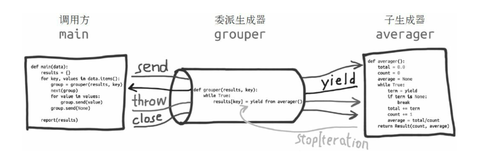

# yield from

#### 说明

1. yield from 是一种全新的语言结构。他的作用比yield多得多
2. 在生成器gen中使用yield from subgen()时,subgen会获得控制权,直接和gen的调用方通信。
3. 调用方直接控制subgen,与此同时,gen会阻塞,等待subgen终止

 

#### yield from使用的简单例子和作用

1. yield from 结构语句可以代替for循环语句

	```
	
	def test():
	    for i in 'ab':
	        yield i
	
	    for i in range(5):
	        yield i
	
	
	print(list(test()))
	
	def test1():
	    yield from 'ab'
	    yield from range(5)
	
	print(list(test1()))
	```
	
2. yield from的其他代用法

	```
	
	def reader():
        for i in range(4):
            yield "<<{}".format(i)


	# def reader_wrapper(g):
	#     for i in g:
	#         yield i
	
	def reader_wrapper(g):
	    yield from g
	
	
	wrap = reader_wrapper(reader())
	
	for i in wrap:
	    print(i)
	
	```

	
	
	>yield from x对x对象所做的第一件事是,调用iter(x),获取迭代器。
	
2. 由上面我们知道了yield from可以对可迭代对象产生一个for循环。但是yield from的功能元元不止这些
	
#### yield from 打开了协程的双向通道

#####说明 
1. 表达式 ``` yield from <subgen> ``` 包含```yield from <subgen>```的函数我们称为委派生成器, ```<subgen>``` 称为子生成器

    
	> 委派生成器在yield from表达式处暂停,调用方可以直接把数据发给子生成器,子生成器再把产出的值发给调用方。子生成器return成功之后,会抛出stopiterion异常,并把返回值附加到异常对象上面，此时委派生成器恢复。

2. 查看示例


    > tcp_ip_socket/yield_from/example_codes/test8.py
    
    
    我们可以看到外部的start函数不断的向最里层的协程发送数据,我们需要一个while循环来每次充值协程的位置
    
    >计算平均数
    
    ```
    
	 def count():
	    print('新的count----')
	    total = 0.0
	    avg = 0.0
	    num = 0
	    while True:
	        data = yield avg
	        if not data:
	            break
	        total += data
	        num += 1
	        avg = total / num
	        print(avg)
	    print('完成count')
	    return num, avg
	
    def pipe(res, key):
		    print('新的协程')
		    while True:
		    # try:
		        yield from count()
		        # print('统计{}数据完成'.format(key))
		
		    # except StopIteration:
		    #     print('已经不能运行')
		
		
	def start(data):
		    res = {}
		    for k, v in data.items():
		        # print(k,v)
		        group = pipe(res, k)
		        next(group)
		        for v1 in v:
		            group.send(v1)
		        group.send(None)
		    print(res)
		
		
	data = {
		    'A班': [90, 89, 60, 68],
		    'B班': [90, 13, 43, 13, 53],
		    'C班': [12, 86, 43, 34, 89, 98, 89]
		}
		
	start(data)

    
    ```
    
3. yield from做的事情

	1. 子生成器产生的值直接传给委派生成器的调用方。
	2. 使用send把值发送给子生成器。如果发送的是none,那么会调用子生成器__next__（）方法。如果不是none
	3. 如果子生成器抛出stopiterion异常,那么委派生成器会恢复运行。

	
4. yield from 所做的事情

	```
	
	_i = iter(EXPR)  # <1>
	try:
	    _y = next(_i)  # <2>
	except StopIteration as _e:
	    _r = _e.value  # <3>
	else:
	    while 1:  # <4>
	        _s = yield _y  # <5>
	        try:
	            _y = _i.send(_s)  # <6>
	        except StopIteration as _e:  # <7>
	            _r = _e.value
	            break
	
	RESULT = _r  # <8>
		
	
	```
	
5. yield from 所做的事情2

	```
	
		_i = iter(EXPR)  # <1>
	try:
	    _y = next(_i)  # <2>
	except StopIteration as _e:
	    _r = _e.value  # <3>
	else:
	    while 1:  # <4>
	        try:
	            _s = yield _y  # <5>
	        except GeneratorExit as _e:  # <6>
	            try:
	                _m = _i.close
	            except AttributeError:
	                pass
	            else:
	                _m()
	            raise _e
	        except BaseException as _e:  # <7>
	            _x = sys.exc_info()
	            try:
	                _m = _i.throw
	            except AttributeError:
	                raise _e
	            else:  # <8>
	                try:
	                    _y = _m(*_x)
	                except StopIteration as _e:
	                    _r = _e.value
	                    break
	        else:  # <9>
	            try:  # <10>
	                if _s is None:  # <11>
	                    _y = next(_i)
	                else:
	                    _y = _i.send(_s)
	            except StopIteration as _e:  # <12>
	                _r = _e.value
	                break
	
	RESULT = _r  # <13>
	
	```
    

    
    