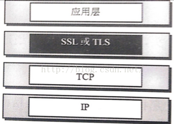

# HTTP协议简介

#####HTTP协议，中文名称为超文本传输协议（HyperText Transfer Protocol），是互联网上应用最为广泛的一种网络协议。在TCP/IP协议族中，普遍认为HTTP协议位于最上层，即第七层（应用层）。因为其位于应用层，所以HTTP协议不涉及数据包（packet）传递，其主要的作用是规定网络上两台需要通信的计算机（即服务器和客户端）的通信格式，HTTP协议默认使用80端口（如果没有明文指明其他端口，但是80端口出于安全原因操作系统通常会默认禁止用户自己的程序使用）。


####网络七层模型


#### HTTP发展到今天一共出现了以下几个版本（按照时间出现先后排序）：

HTTP0.9，1990年问世，目前已过时，仅仅支持GET方法；

HTTP/1.0，1996年5月发布，至今仍被广泛使用，第一个在通讯中制定版本号的HTTP协议版本；

HTTP/1.1，1997年1月发布比1.0版本晚大约半年发布，持久连接默认被采用，能够很好配合代理服务器工作；

HTTP/2，在谷歌自行研发的SPDY协议的基础上发展而来，2015年5月作为互联网标准正式发布；

HTTP/3，未来版本，正在完善当中；

#### tcp/ip四层模型

1. 应用层，决定向用户提供应用服务时通信的活动；
2. 传输层，提供处于网络连接中两台计算机的数据传输，著名的TCP/UDP协议都在这一层；
3. 网络层，处理流动的网络数据包，规定数据包经什么路径从出发点到达目的地；
4. 链路层，处理网络连接相关硬件工作；

当一个HTTP请求被发起时，应用层把数据交给传输层，传输层收到数据后将数据分割打上标记序号和端口号后将数据交给网络层，网络层增加通信目的地的MAC地址后发给链路层，链路层将其发送出去；同理，服务端接收到数据后，逐层向上传递，解除每一层的部首信息，将报文拼接成原始的样子后进行处理。


#### 与HTTP关系密切的协议

在TCP/IP协议族当中，有3个协议与HTTP有非常密切的关系：

1. IP协议，位于网络层，负责数据包的投递。主要依靠IP、MAC以及ARP协议；
2. TCP协议，提供可靠的字节流服务，主要用于分割数据，并确保数据投递到目的地。该协议有著名的“三次握手”策略；
3. DNS服务，位于应用层，提供域名到IP地址的解析服务（MAC地址需要靠IP地址进行反查得到）；

#### http协议的特点

1. 简单快速：客户向服务器请求服务时，只需传送请求方法和路径。请求方法常用的有GET、HEAD、POST。每种方法规定了客户与服务器联系的类型不同。由于HTTP协议简单，使得HTTP服务器的程序规模小，因而通信速度很快。

2. 灵活：HTTP允许传输任意类型的数据对象。正在传输的类型由Content-Type加以标记。

3. 无连接：无连接的含义是限制每次连接只处理一个请求。服务器处理完客户的请求，并收到客户的应答后，即断开连接。采用这种方式可以节省传输时间。但是新的http协议里面有keepalived表示一个长连接，用于持续tcp连接,好传输大量的文件和图片

4. 无状态：HTTP协议是无状态协议。无状态是指协议对于事务处理没有记忆能力。缺少状态意味着如果后续处理需要前面的信息，则它必须重传，这样可能导致每次连接传送的数据量增大。另一方面，在服务器不需要先前信息时它的应答就较快。(cookie seesion解决)


#### 简单的HTTP协议


首先明确以下三点基础知识：

1. 两台计算机在使用HTTP协议进行通信时，一端必须为服务器（server），一端必须为客户端（client）；
2. HTTP协议规定请求（request）由客户端发起，服务器负责响应（response）并返回；
3. HTTP协议是无状态协议，需要由Cookie/session技术实现状态保持；

一个示例请求可以如下：


一个示例响应可以如下：


#### HTTP方法

1. 在HTTP/1.1当中，提供了若干种不同的方法对应不同的需求，下面简要介绍一下（重点需要了解GET和POST方法，其他比较少用）：

2. GET方法，获取资源。请求参数附在地址栏后面，可见的；
3. POST方法，传输实体主体。一般用于提交表单等操作，且表单的内容在地址栏是不可见的；
4. PUT方法，传输文件。自身不带验证机制，任何人都可以上传，存在安全问题；
5. HEAD方法，获得报文部首。和GET类似，但是服务器不返回报文主体；
6. DELETE方法，删除文件。和PUT相反，同样不带验证机制；
7. OPTIONS方法，查询支持方法。查询服务器开放了哪些HTTP方法；
8. TRACE方法，追踪路径。可以查询发送出去的请求是怎样被加工修改的，容易引发XST攻击，通常不会使用；
9. CONNECT方法，要求使用隧道协议连接代理。主要使用SSL和TLS协议加密信息后传输；

#### Cookie技术

HTTP是无状态协议，也就是说它不对之前的请求和响应进行管理，即无法根据之前的状态对本次请求进行处理。假设一个需要登录的网站，在这种情况下，每次刷新页面都得重新登录。但是实际我们并不需要这么做，这就得益于Cookie技术了：

1. 第一次请求：客户端向服务器发起请求，服务器生成cookie用于记住该客户端，将cookie在响应当中返回给客户端，客户端保存该cookie；
2. 第二次以后请求：客户端在请求上主动加上cookie，服务器根据该cookie就可以判断该客户端的身份；


#### HTTP报文内的HTTP信息

用于HTTP协议交互的信息被称为HTTP报文。客户端的HTTP报文叫做请求报文，服务器的HTTP报文叫做响应报文。HTTP报文是由多行数据构成的字符串文本（用CR+LF（\r\n，回车换行符）表示换行），报文大致可以分为：报文部首（必须有的）、报文主体（不一定非要有）。

理解报文主体和实体主体，首先明确以下两个概念：

HTTP报文主体用于传输请求或者响应的实体主体。通常，报文主体和实体主体是一样的，只有当在传输过程中进行了编码操作（编码可以提升传输速率，但是需要消耗CPU资源）时，实体主体的内容会发生变化，从而导致这两者不一样。

状态码
相信大部分人在使用web的时候都遇到过著名的“404”页面，404就是一个HTTP状态码。对于程序员来说，相信大部分人喜欢200多过404了。

HTTP状态码的类别如下：

|状态码|	类别	|原因短语
|---|---|---|
|1XX	|信息状态码（informational）|	接收到的请求正在处理
|2XX	|成功状态码（Success）	|请求正常处理完毕
|3XX	|重定向状态码（Redirection）|	需要进行附加的操作完成请求
|4XX	|客户端错误状态码（Client Error）|	服务器无法处理请求
|5XX	|服务器错误状态码（Server Error）	|服务器处理请求出错

## HTTP首部

#### HTTP报文部


一个完整的HTTP报文应该有以下结构：

1. （HTTP）报文首部；
2. 空行（CR + LF）；
3. （HTTP）报文主体；
HTTP报文首部由几个字段组成，分别是：请求行（状态行）、请求（响应）首部字段、通用首部字段、实体首部字段和其他。其中，以”首部字段“四字结尾的几个字段合称为HTTP首部字段。

#### HTTP首部字段

>HTTP 首部字段是构成 HTTP 报文的要素之一。在客户端与服务器之间以 HTTP 协议进行通信的过程中，无论是请求还是响应都会使用首部字段，它能起到传递额外重要信息的作用。使用首部字段是为了给浏览器和服务器提供报文主体大小、所使用的语言、认证信息等内容。


首部字段的结构如下所示：

```
首部字段名称：字段值
// example
Content-Type: text/html
Keep-Alive: timeout=15, max=100
```

1. 通用首部字段（General Header Fields），请求和响应报文都会使用的首部；
2. 请求首部字段（Request Header Fields），客户端使用的首部，补充请求的附加信息；
3. 响应首部字段（Response Header Fields），服务器使用的首部，补充响应的附加信息；
4. 实体首部字段（Entity Header Fields），针对报文实体使用的首部，补充资源内容更新等于实体有关信息；

#### 为Cookie服务的首部字段

由于HTTP协议是无状态协议，在实际的开发中，往往我们又需要保存用户的状态信息。这时候就要用到Cookie，所以单独列一小节探究一下与其相关的首部字段。主要就是以下两个字段：

|首部字段名	|说明	|首部类型
|---|---|---|
|Set-Cookie|	开始状态管理所使用的Cookie信息	|响应首部字段
|Cookie	|服务器收到的Cookie信息	|请求首部字段


比较需要注意的是expires这个属性，它指定了浏览器可以发送Cookie的有效期。当该属性省略是，有效期默认为浏览器会话（session）时间段内。另外，一旦Cookie被发送到客户端，服务端就不存在修改它的方法。但是可以通过覆盖已过期的Cookie，实现对客户端Cookie的实质性删除操作。

#### Cookie

```
Cookie: status=enable
```

当客户端想要获得状态管理支持时，就会在请求中包含从服务器接收到的Cookie。接收到多个Cookie时，同样可以以多个Cookie的形式发送。


#### session


Cookie有一个特点就是Cookie存在于客户端中，而Session则是存在于服务器中！


Session是如何工作的？

我们知道，Session信息是存储到服务器端的，但是不同的浏览器可能在服务器上都存储了属于自己的Session信息，但是浏览器怎么去寻找属于自己的Session呢。

就如同，我们去公安局查信息，我们只需要输入自己的身份证号就可以匹配到唯一的身份证信息。Session机制也是这样的，浏览器在访问服务器的时候，将自己的sessionid给服务器，服务器就可以根据这个ID去匹配查找Session信息。由此，我们推断出在服务器端，Session的存储机制是key=value的形式，我们可以保证key一定是sessionid


Session的缺点：

没有任何一种技术是完美无瑕的，任何一种技术都有它的优缺点，Session也不例外。据我所了解的，Session的缺点就一下几点，欢迎大家补充：

1. 如果Session的实现是依赖于Cookie的话，那么浏览器必须要支持Cookie,否则歇菜。

2. 过多的浏览器请求，会在服务器端创建很多的Session信息，会对浏览器造成一定的内存压力，而且不易于维护。

#### csrf攻击

##### CSRF是什么？

Cross Site Request Forgery, 跨站域请求伪造）是一种网络的攻击方式，它在 2007 年曾被列为互联网 20 大安全隐患之一,也被称为“One Click Attack”或者Session Riding，通常缩写为CSRF或者XSRF，是一种对网站的恶意利用。尽管听起来像跨站脚本（XSS），但它与XSS非常不同，并且攻击方式几乎相左。XSS利用站点内的信任用户，而CSRF则通过伪装来自受信任用户的请求来利用受信任的网站。与XSS攻击相比，CSRF攻击往往不大流行（因此对其进行防范的资源也相当稀少）和难以防范，所以被认为比XSS更具危险性。

##### CSRF可以做什么？

你这可以这么理解CSRF攻击：攻击者盗用了你的身份，以你的名义发送恶意请求。CSRF能够做的事情包括：以你名义发送邮件，发消息，盗取你的账号，甚至于购买商品，虚拟货币转账......造成的问题包括：个人隐私泄露以及财产安全。

##### 原理


从上图可以看出，要完成一次CSRF攻击，受害者必须依次完成两个步骤：

登录受信任网站A，并在本地生成Cookie。
在不登出A的情况下，访问危险网站B。
看到这里，你也许会说：“如果我不满足以上两个条件中的一个，我就不会受到CSRF的攻击”。是的，确实如此，但你不能保证以下情况不会发生：

1. 你不能保证你登录了一个网站后，不再打开一个tab页面并访问另外的网站。
2. 你不能保证你关闭浏览器了后，你本地的Cookie立刻过期，你上次的会话已经结束。（事实上，关闭浏览器不能结束一个会话，但大多数人都会错误的认为关闭浏览器就等于退出登录/结束会话了......）
3. 上图中所谓的攻击网站，可能是一个存在其他漏洞的可信任的经常被人访问的网站。


##### POST类型的CSRF

```
<form action=http://wooyun.org/csrf.php method=POST>
<input type="text" name="xx" value="11" />
</form>
<script> document.forms[0].submit(); </script>

```

防护: 在表单中加入token来防护


#### https

##### 安全套接字（Secure Socket Layer，SSL）协议是Web浏览器与Web服务器之间安全交换信息的协议。

##### SSL协议的三个特性：
1. 保密：在握手协议中定义了会话密钥后，所有的消息都被加密。

2. 鉴别：可选的客户端认证，和强制的服务器端认证。

3. 完整性：传送的消息包括消息完整性检查（使用MAC）。



HTTPS基于SSL的HTTP协议。

HTTPS使用与HTTP不同的端口(，一个加密、身份验证层（HTTP与TCP之间）)。

提供了身份验证与加密通信方法，被广泛用于互联网上安全敏感的通信。

HTTPS（全称：Hyper Text Transfer Protocol over Secure Socket Layer），是以安全为目标的HTTP通道，简单讲是HTTP的安全版。即HTTP下加入SSL层，HTTPS的安全基础是SSL，因此加密的详细内容就需要SSL。 它是一个URI scheme（抽象标识符体系），句法类同http:体系。用于安全的HTTP数据传输。https:// URL表明它使用了HTTP，但HTTPS存在不同于HTTP的默认端口及一个加密/身份验证层（在HTTP与TCP之间）。这个系统的最初研发由网景公司(Netscape)进行，并内置于其浏览器Netscape Navigator中，提供了身份验证与加密通讯方法。现在它被广泛用于万维网上安全敏感的通讯，例如交易支付方面。

区别就是一个安全，一个效率高：

HTTP协议传输的数据都是未加密的，也就是明文的，因此使用HTTP协议传输隐私信息非常不安全，为了保证这些隐私数据能加密传输，于是网景公司设计了SSL（Secure Sockets Layer）协议用于对HTTP协议传输的数据进行加密，从而就诞生了HTTPS。
HTTPS加密、加密、及验证过程，如下图所示：


简单来说，HTTPS协议是由SSL+HTTP协议构建的可进行加密传输、身份认证的网络协议，要比http协议安全。

#### HTTPS和HTTP的区别主要如下：
1. https协议需要到ca申请证书，一般免费证书较少，因而需要一定费用。
2. http是超文本传输协议，信息是明文传输，https则是具有安全性的ssl加密传输协议。
3. http和https使用的是完全不同的连接方式，用的端口也不一样，前者是80，后者是443。
4. http的连接很简单，是无状态的；HTTPS协议是由SSL+HTTP协议构建的可进行加密传输、身份认证的网络协议，比http协议安全。
HTTPS交互过程：
客户端请求建立SSL连接，并将自己支持的一套加密规则发送给网站。
网站从中选出一组加密算法与HASH算法，并将自己的身份信息以证书的形式发回给浏览器。证书里面包含了网站地址，加密公钥，以及证书的颁发机构等信息
获得网站证书之后浏览器要做以下工作：
1. 验证证书的合法性
2. 如果证书受信任，浏览器会生成一串随机数的密码，并用证书中提供的公钥加密。
3. 使用约定好的HASH计算握手消息，
4. 使用生成的随机数对消息进行加密，最后将之前生成的所有信息发送给网站。
网站接收浏览器发来的数据之后要做以下的操作：
5. 使用自己的私钥将信息解密取出密码
6. 使用密码解密浏览器发来的握手消息，并验证HASH是否与浏览器发来的一致。
7. 使用密码加密一段握手消息，发送给浏览器
浏览器解密并计算握手消息的HASH，如果与服务端发来的HASH一致，此时握手结束。
使用随机密码和对称加密算法对传输的数据加密，传输。


#### get请求和post请求的区别

1. 区别在于一个修改资源和获取资源
2. get可以用于保存收藏连接地址
3. post请求可以把请求的内容放在报文里面


#### 其他应用层协议


