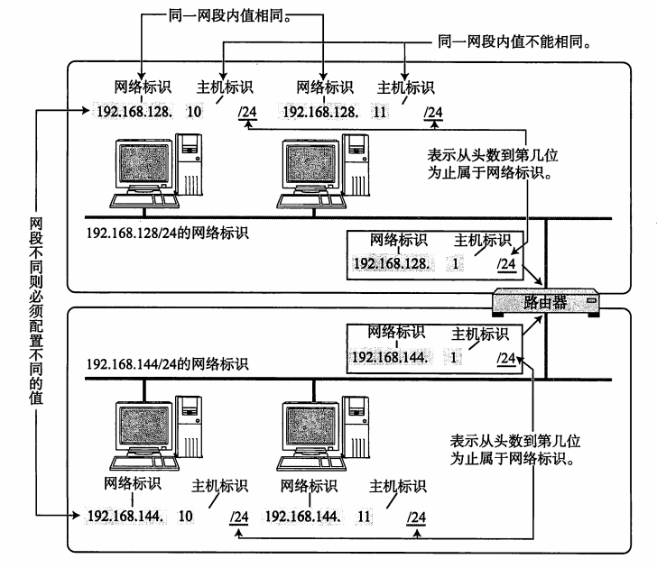
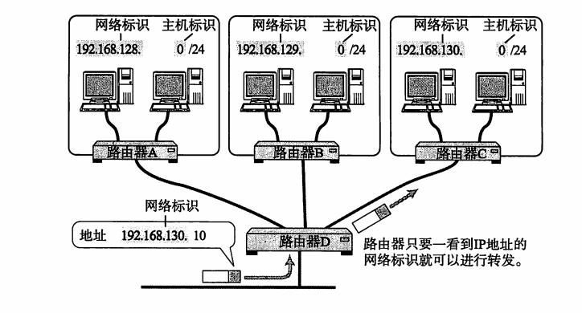
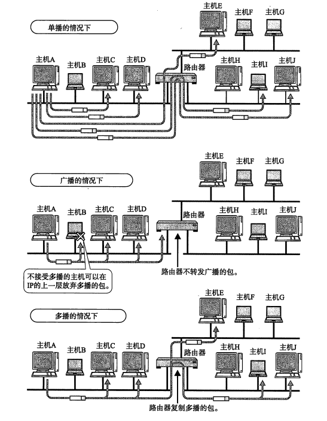
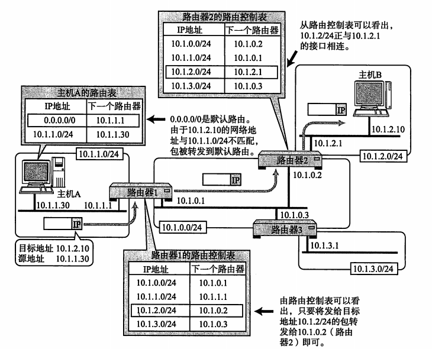
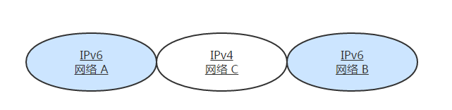

# IP 协议

1. IP（IPv4、IPv6）相当于 OSI 参考模型中的第3层——网络层。网络层的主要作用是“实现终端节点之间的通信”。这种终端节点之间的通信也叫“点对点通信”。
2. 网络的下一层——数据链路层的主要作用是在互连同一种数据链路的节点之间进行包传递。而一旦跨越多种数据链路，就需要借助网络层。网络层可以跨越不同的数据链路，即使是在不同的数据链路上也能实现两端节点之间的数据包传输。
3. <b>IP 大致分为三大作用模块，它们是 IP 寻址、路由（最终节点为止的转发）以及 IP 分包与组包。</b>

##1. IP 地址
####1.1 IP 地址概述
1. 在计算机通信中，为了识别通信对端，必须要有一个类似于地址的识别码进行标识。在数据链路中的 MAC 地址正是用来标识同一个链路中不同计算机的一种识别码。
2. 作为网络层的 IP ,也有这种地址信息，一般叫做 IP 地址。IP 地址用于在“连接到网络中的所有主机中识别出进行通信的目标地址”。因此，在 TCP/IP 通信中所有主机或路由器必须设定自己的 IP 地址。
3. 不论一台主机与哪种数据链路连接，其 IP 地址的形式都保持不变。
4. IP 地址（IPv4 地址）由32位正整数来表示。IP 地址在计算机内部以二进制方式被处理。然而，由于我们并不习惯于采用二进制方式，我们将32位的 IP 地址以每8位为一组，分成4组，每组以 “.” 隔开，再将每组数转换成十进制数。如下：

|28  |	28  |	28|	28 |
|----|----|----|----|	
|10101100.	|00010100.|	00000001.|	00000001（2制）
|172.|	20.	|1.	|1	（10进制）

#### 1.2 IP 地址由网络和主机两部分标识组成

1. 如下图，网络标识在数据链路的每个段配置不同的值。网络标识必须保证相互连接的每个段的地址不相重复。而相同段内相连的主机必须有相同的网络地址。IP 地址的“主机标识”则不允许在同一个网段内重复出现。由此，可以通过设置网络地址和主机地址，在相互连接的整个网络中保证每台主机的 IP 地址都不会相互重叠。即 IP 地址具有了唯一性。

    

2. 如下图，IP 包被转发到途中某个路由器时，正是利用目标 IP 地址的网络标识进行路由。因为即使不看主机标识，只要一见到网络标识就能判断出是否为该网段内的主机。

    
    
##### 1.3 IP 地址的分类

1. IP 地址分为四个级别，分别为A类、B类、C类、D类。它根据 IP 地址中从第 1 位到第 4 位的比特列对其网络标识和主机标识进行区分。
2. A 类 IP 地址是首位<b>以 “0” 开头的地址</b>。从第 1 位到第 8 位是它的网络标识。用十进制表示的话，0.0.0.0~127.0.0.0 是 A 类的网络地址。A 类地址的后 24 位相当于主机标识。因此，一个网段内可容纳的主机地址上限为16,777,214个。
3. B 类 IP 地址是前两位 “10” 的地址。从第 1 位到第 16 位是它的网络标识。用十进制表示的话，128.0.0.0~191.255.0.0 是 B 类的网络地址。B 类地址的后 16 位相当于主机标识。因此，一个网段内可容纳的主机地址上限为65,534个。
4. C 类 IP 地址是前三位为 “110” 的地址。从第 1 位到第 24 位是它的网络标识。用十进制表示的话，192.0.0.0~223.255.255.0 是 C 类的网络地址。C 类地址的后 8 位相当于主机标识。因此，一个网段内可容纳的主机地址上限为254个。
5. D 类 IP 地址是前四位为 “1110” 的地址。从第 1 位到第 32 位是它的网络标识。用十进制表示的话，224.0.0.0~239.255.255.255 是 D 类的网络地址。D 类地址没有主机标识，常用于多播。
6. 在分配 IP 地址时关于主机标识有一点需要注意。即要用比特位表示主机地址时，不可以全部为 0 或全部为 1。因为全部为 0 只有在表示对应的网络地址或 IP 地址不可以获知的情况下才使用。而全部为 1 的主机通常作为广播地址。因此，在分配过程中，应该去掉这两种情况。这也是为什么 C 类地址每个网段最多只能有 254（ 28 - 2 = 254）个主机地址的原因。

##### 1.4 广播地址
1. 广播地址用于在同一个链路中相互连接的主机之间发送数据包。<b>将 IP 地址中的主机地址部分全部设置为 1，就成了广播地址。</b>
2. 广播分为本地广播和直接广播两种。在本网络内的广播叫做本地广播；在不同网络之间的广播叫做直接广播。

##### 1.5 IP 多播
1. 多播用于将包发送给特定组内的所有主机。由于其直接使用 IP 地址，因此也不存在可靠传输。
2. 相比于广播，多播既可以穿透路由器，又可以实现只给那些必要的组发送数据包。请看下图：

   
   
3. 多播使用 D 类地址。因此，如果从首位开始到第 4 位是 “1110”，就可以认为是多播地址。而剩下的 28 位可以成为多播的组编号。
4. 此外， 对于多播，所有的主机（路由器以外的主机和终端主机）必须属于 224.0.0.1 的组，所有的路由器必须属于 224.0.0.2 的组。

##### 1.6 子网掩码
1. 现在一个 IP 地址的网络标识和主机标识已不再受限于该地址的类别，而是由一个叫做“子网掩码”的识别码通过子网网络地址细分出比 A 类、B 类、C 类更小粒度的网络。这种方式实际上就是将原来 A 类、B 类、C 类等分类中的主机地址部分用作子网地址，可以将原网络分为多个物理网络的一种机制。
2. 子网掩码用二进制方式表示的话，也是一个 32 位的数字。它对应 IP 地址网络标识部分的位全部为 “1”，对应 IP 地址主机标识的部分则全部为 “0”。由此，一个 IP 地址可以不再受限于自己的类别，而是可以用这样的子网掩码自由地定位自己的网络标识长度。当然，子网掩码必须是 IP 地址的首位开始连续的 “1”。
3. 对于子网掩码，目前有两种表示方式。第一种是，将 IP 地址与子网掩码的地址分别用两行来表示。以 172.20.100.52 的前 26 位是网络地址的情况为例，如下：

	|IP 地址|	172.	|20.	|100.	|52
	|---|---|---|---|---|
	|子网掩码|	255.	|255.	|255.	|192
	|网络地址|	172.	|20.	|100.	|0
	|广播地址|	172.	|20.	|100.	|63

4. 第二种表示方式是，在每个 IP 地址后面追加网络地址的位数用 “/ ” 隔开，如下：

		
	|IP 地址|	172.	|20.	|100.	|52|	/ 26|
	|---|---|---|---|---|---|
	|网络地址|	172.	|20.	|100.	|0	|/ 26
	|广播地址|	172.	|20.	|100.	|63	|/ 26
	
5. 另外，在第二种方式下记述网络地址时可以省略后面的 “0” 。例如：172.20.0.0/26 跟 172.20/26 其实是一个意思。

6. 网络组等于ip地址和子网掩码的位运算,广播地址等于网络地址+主机地址全部变成1

#### 2. 路由
1. 发送数据包时所使用的地址是网络层的地址，即 IP 地址。然而仅仅有 IP 地址还不足以实现将数据包发送到对端目标地址，在数据发送过程中还需要类似于“指明路由器或主机”的信息，以便真正发往目标地址。保存这种信息的就是路由控制表。
2. 该路由控制表的形成方式有两种：一种是管理员手动设置，另一种是路由器与其他路由器相互交换信息时自动刷新。前者也叫做静态路由控制，而后者叫做动态路由控制。
3. IP 协议始终认为路由表是正确的。然后，IP 本身并没有定义制作路由控制表的协议。即 IP 没有制作路由控制表的机制。该表示由一个叫做“路由协议”的协议制作而成。

##### 2.1 IP 地址与路由控制
1. IP 地址的网络地址部分用于进行路由控制。
2. 路由控制表中记录着网络地址与下一步应该发送至路由器的地址。
3. 在发送 IP 包时，首先要确定 IP 包首部中的目标地址，再从路由控制表中找到与该地址具有相同网络地址的记录，根据该记录将 IP 包转发给相应的下一个路由器。如果路由控制表中存在多条相同网络地址的记录，就选择一个最为吻合的网络地址。

	
	
#### 3. IP 分包与组包

1. 每种数据链路的最大传输单元（MTU）都不尽相同，因为每个不同类型的数据链路的使用目的不同。使用目的不同，可承载的 MTU 也就不同。
2. 任何一台主机都有必要对 IP 分片进行相应的处理。分片往往在网络上遇到比较大的报文无法一下子发送出去时才会进行处理。
3. 经过分片之后的 IP 数据报在被重组的时候，只能由目标主机进行。路由器虽然做分片但不会进行重组。

##### 3.1 路径 MTU 发现

1. 分片机制也有它的不足。如路由器的处理负荷加重之类。因此，只要允许，是不希望由路由器进行 IP 数据包的分片处理的。
2. 为了应对分片机制的不足，“路径 MTU 发现” 技术应运而生。路径 MTU 指的是，从发送端主机到接收端主机之间不需要分片是最大 MTU 的大小。即路径中存在的所有数据链路中最小的 MTU 。
3. 进行路径 MTU 发现，就可以避免在中途的路由器上进行分片处理，也可以在 TCP 中发送更大的包。

4. IPv6
IPv6（IP version 6）是为了根本解决 IPv4 地址耗尽的问题而被标准化的网际协议。IPv4 的地址长度为 4 个 8 位字节，即 32 比特。而 IPv6 的地址长度则是原来的 4 倍，即 128 比特，一般写成 8 个 16 位字节。

#### 4.1 IPv6 的特点
1. IP 得知的扩大与路由控制表的聚合。
2. 性能提升。包首部长度采用固定的值（40字节），不再采用首部检验码。简化首部结构，减轻路由器负担。路由器不再做分片处理。
3. 支持即插即用功能。即使没有DHCP服务器也可以实现自动分配 IP 地址。
4. 采用认证与加密功能。应对伪造 IP 地址的网络安全功能以及防止线路窃听的功能。
5. 多播、Mobile IP 成为扩展功能。

#### 5. IP 协议相关技术
IP 旨在让最终目标主机收到数据包，但是在这一过程中仅仅有 IP 是无法实现通信的。必须还有能够解析主机名称和 MAC 地址的功能，以及数据包在发送过程中异常情况处理的功能。
##### 5.1 DNS
我们平常在访问某个网站时不适用 IP 地址，而是用一串由罗马字和点号组成的字符串。而一般用户在使用 TCP/IP 进行通信时也不使用 IP 地址。能够这样做是因为有了 DNS （Domain Name System）功能的支持。DNS 可以将那串字符串自动转换为具体的 IP 地址。
这种 DNS 不仅适用于 IPv4，还适用于 IPv6。
##### 5.2 ARP
只要确定了 IP 地址，就可以向这个目标地址发送 IP 数据报。然而，在底层数据链路层，进行实际通信时却有必要了解每个 IP 地址所对应的 MAC 地址。
ARP 是一种解决地址问题的协议。以目标 IP 地址为线索，用来定位下一个应该接收数据分包的网络设备对应的 MAC 地址。不过 ARP 只适用于 IPv4，不能用于 IPv6。IPv6 中可以用 ICMPv6 替代 ARP 发送邻居探索消息。
RARP 是将 ARP 反过来，从 MAC 地址定位 IP 地址的一种协议。
##### 5.3 ICMP
ICMP 的主要功能包括，确认 IP 包是否成功送达目标地址，通知在发送过程当中 IP 包被废弃的具体原因，改善网络设置等。
IPv4 中 ICMP 仅作为一个辅助作用支持 IPv4。也就是说，在 IPv4 时期，即使没有 ICMP，仍然可以实现 IP 通信。然而，在 IPv6 中，ICMP 的作用被扩大，如果没有 ICMPv6，IPv6 就无法进行正常通信。
##### 5.4 DHCP
如果逐一为每一台主机设置 IP 地址会是非常繁琐的事情。特别是在移动使用笔记本电脑、只能终端以及平板电脑等设备时，每移动到一个新的地方，都要重新设置 IP 地址。
于是，为了实现自动设置 IP 地址、统一管理 IP 地址分配，就产生了 DHCP（Dynamic Host Configuration Protocol）协议。有了 DHCP，计算机只要连接到网络，就可以进行 TCP/IP 通信。也就是说，DHCP 让即插即用变得可能。
DHCP 不仅在 IPv4 中，在 IPv6 中也可以使用。
##### 5.5 NAT
NAT（Network Address Translator）是用于在本地网络中使用私有地址，在连接互联网时转而使用全局 IP 地址的技术。
除转换 IP 地址外，还出现了可以转换 TCP、UDP 端口号的 NAPT（Network Address Ports Translator）技术，由此可以实现用一个全局 IP 地址与多个主机的通信。
NAT（NAPT）实际上是为正在面临地址枯竭的 IPv4 而开发的技术。不过，在 IPv6 中为了提高网络安全也在使用 NAT，在 IPv4 和 IPv6 之间的相互通信当中常常使用 NAT-PT。
##### 5.6 IP 隧道

1. 如上图的网络环境中，网络 A 与网络 B 之间无法直接进行通信，为了让它们之间正常通信，这时必须得采用 IP 隧道的功能。
2. IP 隧道可以将那些从网络 A 发过来的 IPv6 的包统合为一个数据，再为之追加一个 IPv4 的首部以后转发给网络 C。
3. 一般情况下，紧接着 IP 首部的是 TCP 或 UDP 的首部。然而，现在的应用当中“ IP 首部的后面还是 IP 首部”或者“ IP 首部的后面是 IPv6 的首部”等情况与日俱增。这种在网络层的首部后面追加网络层首部的通信方法就叫做“ IP 隧道”。

## 参考资料: 

1 . <a href="https://www.jianshu.com/p/907c4cd5d33b">子网掩码</a>
