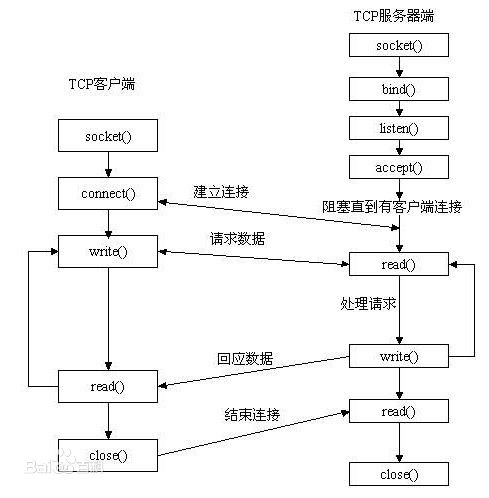

# socket

## 1. 概述

Socket是应用层与TCP/IP协议族通信的中间软件抽象层，它是一组接口，把复杂的TCP/IP协议族隐藏在Socket接口后面，对用户来说，一组简单的接口就是全部，让Socket去组织数据，以符合指定的协议。

   
   
## 3. socket基础

1. 

## 2. socket聊天室代码

1. socket server代码的步骤一般如下

    
    
    1. 服务器端
    
    	1. 服务器首先初始化好socket
    	2. 绑定这个socket服务器运行的ip地址和端口
    	3. 监听这个服务器
    	4. 等待socket连接,这个步骤会一直阻塞,直到有socket链接进来
    	5. 当连接成功之后,服务器就可以读取客户端发送的socket消息
    	6. 服务器可以选择给客户端回传socket消息
    	7. 服务器关闭socket

    2. 客户端
    
    	1. 客户端初始化socket
    	2. 客户端去和服务器建立链接
    	3. 客户端向服务器发送数据
    	4. 客户端等待服务器相应数据
    	5. 客户端关系socket

    3. 按照上述描述,python代码(伪)书写应该如下

        ```   
        ss = socket() 
        ss.bind() 
        ss.listen() 
        inf_loop:
			  cs = ss.accept() 
			  comm_loop:
			      cs.recv()/cs.send() 
			      cs.close()
			  ss.close()
        ```
    	
2. python socket库基础知识

    1. 要创建套接字，必须使用 socket.socket()函数，它一般的语法如下。 socket(socket_family, socket_type, protocol=0)。socket.socket是new出来socket套接字对象,但是通信的运输层有tcp或者upd来通信. 网络层有ip协议来传输和本地[非网络的 AF_LOCAL/AF_UNIX]套接字来传输数据。所以我们需要配置socket_family和socket_type
    
        1. socket_family

            1. AF_INET表示使用ipv4协议来传输
            2. AF_UNIX表示使用非网络的套接字来传输

        2. socket_type
        
        	   1. SOCK_STREAM 表示tcp协议
        	   2. SOCK_DGRAM 表示使用upd协议来连接

        
        3. 综合:
        
        	   所以说 tcpSock = socket(AF_INET, SOCK_STREAM)表示使用ip和tcp来进行通信
        	   
     
     
    2. s.bind():
        将地址(主机名、端口号对)绑定到套接字上
         
    3. ss.listen():
    
        设置并启动 TCP 监听器
        
    4. ss.accept():
    
    	 被动接受 TCP 客户端连接，一直等待直到连接到达(阻塞)
    
    5. s.recv():
    
    	接受socket消息，请注意 上面的方法是接受连接
    	
    6. s.send():
    
        发送 TCP 消息
        
    7. s.close():
    
        关闭套接字
   		
3. 服务器/客户端实际代码v1(简单的流程演示):

    
    1. 服务器代码: 

		> tcp_ip_socket/socket_chat/v1/server.py
		
        ```
          import socket

			bind_address = ("0.0.0.0",19527)
			
			#申明
			ss = socket.socket(socket.AF_INET,socket.SOCK_STREAM)
			#绑定地址和监听
			ss.bind(bind_address)
			ss.listen()
			#获取客户端socket和地址
			cli,addr = ss.accept()
			#获取tcp消息 一次1kb
			msg = cli.recv(1024)
			print(msg)
			#回送消息
			cli.send(b'get')
			ss.close()

        ```  	
        
    2. 客户端代码

        > tcp_ip_socket/socket_chat/v1/client.py
        
        ```
        
			import socket
			send_address = ("0.0.0.0",19527)
			cli = socket.socket(socket.AF_INET,socket.SOCK_STREAM)
			#直接连接
			cli.connect(send_address)
			#发送数据
			cli.send(b'teset')
			#接受数据
			msg = cli.recv(1024)
			print(msg)
			cli.close()
        
        ``` 	
        
4. 服务器/客户端代码(更有交互性的代码)
	
	1. 说明:
	    这次的代码,让服务器和客户端更有交互性,客户端输入消息后,服务器返回消息
	    
	2. 代码:

		>tcp_ip_socket/socket_chat/v2/server.py
		
		```
		import socket

		ss_address = ("0.0.0.0",19534)
		ss = socket.socket(socket.AF_INET,socket.SOCK_STREAM)
		ss.bind(ss_address)
		ss.listen(2)
		while True:
		    #获取连接
		    cli,addr = ss.accept()
		    print('收到来自ip为{}的连接'.format(addr))
		    #在连接的时候,进入循环
		    while True:
		        # 接受消息
		        data = cli.recv(1024)
		        if not data:
		            break
		        re_msg = "收到你的消息{}".format(data.decode('utf8'))
		        cli.send(re_msg.encode('utf8'))
		    cli.close()
		
		```
		
		>tcp_ip_socket/socket_chat/v2/client.py
		
		```
		
		import socket

		ss_address = ("0.0.0.0",19534)
		ss = socket.socket(socket.AF_INET,socket.SOCK_STREAM)
		ss.bind(ss_address)
		ss.listen(2)
		while True:
		    #获取连接
		    cli,addr = ss.accept()
		    print('收到来自ip为{}的连接'.format(addr))
		    #在连接的时候,进入循环
		    while True:
		        # 接受消息
		        data = cli.recv(1024)
		        if not data:
		            break
		        re_msg = "收到你的消息{}".format(data.decode('utf8'))
		        cli.send(re_msg.encode('utf8'))
		    cli.close()
		
		```
		
5. 客户端接受http请求,并且返回http代码

	1. 说明:
		我们在获取http代码的时候,获取http代码的库文件,或者浏览器底层,就是用了socket来获取http报文,我们可以模拟底层的报文请求方式,来深一步的了解http报文结构
		
	2. 代码:

	> tcp_ip_socket/socket_chat/another_socket/http_req.py
	
	```
	
	# 使用socket获取http报文
	import socket
	from urllib.parse import urlparse
	
	# 初始化socket
	ss = socket.socket(socket.AF_INET, socket.SOCK_STREAM)
	domain = "https://www.baidu.com"
	url = urlparse(domain)
	host = url.netloc
	path = url.path
	if path == "":
	    path = "/"
	ss.connect((host, 80))
	#'\r'的本意是回到行首，'\n'的本意是换行
	data = "GET {} HTTP/1.1\r\nHost:{}\r\nConnection:close\r\nUser-Agent:Mozilla/5.0 (Macintosh; Intel Mac OS X 10_13_6) AppleWebKit/537.36 (KHTML, like Gecko) Chrome/69.0.3497.100 Safari/537.36\r\n\r\n".format(
	    path, host).encode('utf8')
	ss.send(data)
	res = b""
	#报文就不像聊天数据那么小了 需要循环的拼接报文
	while True:
	    d = ss.recv(1024)
	    if d:
	        res += d
	    else:
	        break
	print(res.decode('utf8'))
	ss.close()
	```
	
		 
	

6. 多线程聊天代码演示

	1. 说明: 刚才的版本只能接受一个连接,我们可以使用多线程版本来优化代码
		
	2. 代码:
	
		>tcp_ip_socket/socket_chat/v5/server.py
		
		```
		
		import socket
		import threading
		
		def cli_msg(cli,addr):
		    print('收到来自ip为{}的连接'.format(addr))
		    #在连接的时候,进入循环
		    while True:
		        # 接受消息
		        data = cli.recv(1024)
		        if not data:
		            break
		        re_msg = "收到你的消息{}".format(data.decode('utf8'))
		        cli.send(re_msg.encode('utf8'))
		    cli.close()
		    return True
		
		ss_address = ("0.0.0.0",19534)
		ss = socket.socket(socket.AF_INET,socket.SOCK_STREAM)
		ss.bind(ss_address)
		ss.listen(2)
		
		
		while True:
		    #获取连接
		    cli,addr = ss.accept()
		    threading.Thread(target=cli_msg,args=(cli,addr)).start()


		
		
		```
		
		>tcp_ip_socket/socket_chat/v5/client.py
		
		```
		
		import socket

		ss_address = ("0.0.0.0",19534)
		
		ss = socket.socket(socket.AF_INET,socket.SOCK_STREAM)
		
		ss.connect(ss_address)
		
		while True:
		    data = input('请输入消息:')
		    if not data:
		        break
		    ss.send(data.encode('utf8'))
		    print(ss.recv(1024).decode('utf8'))
		
		
		ss.close()


		```
		

   	

